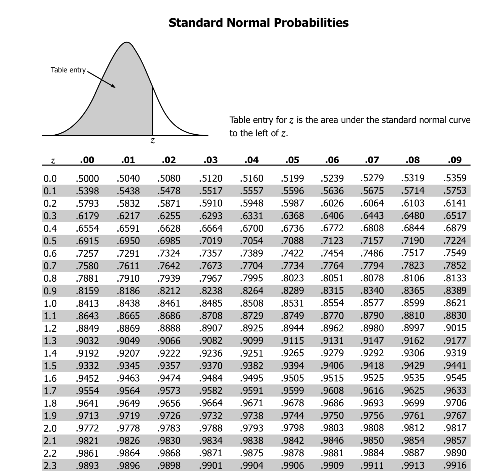

```{r setup, include=FALSE}
options(htmltools.dir.version = FALSE)
```

```{r xaringan-extra-all-the-things, echo=FALSE}
xaringanExtra::use_xaringan_extra(
  c("tile_view", "panelset", "editable", "animate", "tachyons", "webcam")
)
```

```{r, 'helpers', echo=FALSE, message=F, warning=F}
source(here::here("slides", "assets", "scripts", "helpers.R"))
```

class: inverse, middle

<blockquote align='center' class="twitter-tweet" data-lang="de">
<a href="https://twitter.com/hadleywickham/status/565516733516349441?ref_src=twsrc%5Etfw"></a>
</blockquote>

---
exclude: true
class: title-slide-section-grey, middle

# More about z-scores

---
exclude: true

# More about z-scores

```{r, 'standard-normal', echo=FALSE, fig.height=6.5, fig.width=6.5, out.extra='style=float:right', fig.retina=2, warning=FALSE, cache=FALSE}
# Save PDF of normal to object for plot
pdf_tex2 <- "$f(x)= \\frac{1}{\\sqrt{2 \\pi}\\times 2}\\, e^{-\\,\\frac{(x - 15 )^2}{2}}$"
pdf_tex4 <- "$f(x)= \\frac{1}{\\sqrt{2 \\pi}}\\, e^{\\,-\\frac{x^2}{2}}$"

standard_x <- c(TeX('-4$\\sigma$'), 
                TeX('-3$\\sigma$'), 
                TeX('-2$\\sigma$'), 
                TeX('-1$\\sigma$'), 
                TeX('0$\\sigma$'), 
                TeX('1$\\sigma$'), 
                TeX('2$\\sigma$'), 
                TeX('3$\\sigma$'), 
                TeX('4$\\sigma$'))

normalp1 <- plot_dist(range = c(5, 25), mean = 15, sd = 2) + 
    labs(y = NULL, x = NULL) + 
    scale_y_continuous(breaks = NULL) 

normalp2 <- plot_dist(range = c(-4, 4), font_color = "darkblue") + 
  labs(y = NULL, x = NULL) + 
  scale_y_continuous(breaks = NULL) + 
  scale_x_continuous(breaks = seq(-4, 4, 1), 
                     labels = standard_x) 

normalp1 / normalp2
```

- The normal distribution is defined by a mean  
and SD: *N*(μ, σ)  
--
exclude: true

i.e., "sample x follows a normal distribution  
with a mean of 15 and a SD of 2": .RUred[*N*(15, 2)]

--
exclude: true

- An important case of the normal distribution  
is the *standard normal distribution* (using  
z-scores): .blue[*N*(0, 1)]

--
exclude: true

- Same characteristics as a non-standardized normal:
  - 68% of the data fall within 1σ of µ
  - 95% of the data fall within 2σ of µ
  - 99.7% of the data fall within 3σ of µ
  - **Sum of area under the curve = 1**

--
exclude: true

- Thus we can make probability statements  
about a sample distribution

---
exclude: true

class: title-slide-section-grey, middle

# Probability

---
exclude: true

layout: true

# Probability

---
exclude: true

```{r, 'standard-normal2', echo=FALSE, fig.height=6.5, fig.width=6.5, out.extra="style='float:right'", fig.retina=2}

normalp3 <- plot_dist(range = c(-4, 4), tex = "$\\textit{P}(x)$", 
  font_color = "black") + 
  geom_vline(xintercept = 0, lty = 3) + 
  labs(y = NULL, x = NULL, title = 'Probability Density Function') + 
  scale_y_continuous(position = "right") + 
  scale_x_continuous(breaks = seq(-4, 4, 1), labels = standard_x) +
  annotate("text", x = 2.5, y = 0.3, size = 7, 
    label = TeX(pdf_tex4, output = "character"), parse = T) 

normalp4 <- plot_dist(distribution = "pnorm", range = c(-4, 4), 
  tex = "$\\textit{D}(x)$", font_color = "black") + 
  geom_hline(yintercept = 0.5, lty = 3) + 
  labs(y = NULL, x = NULL, title = 'Distribution Function') + 
  scale_y_continuous(position = "right") + 
  scale_x_continuous(breaks = seq(-4, 4, 1), 
                     labels = standard_x)

normalp3 / normalp4
```

- **The total area under the probability density function = 1**

--
exclude: true

- A portion of the area under the curve is = to  
some proportion of 1

--
exclude: true

- area = ratio = probability 

--
exclude: true

- We can determine the probability of finding a  
value less than, greater than, or between a  
value (values) of x

--
exclude: true

- We can make probability statements about our  
data if we standardize it and compare it with  
the normal distribution 

- Let's practice

---
exclude: true

.pull-left[

Test scores are *N*(80, 5)

1. The shaded **area** in (1) is 0.5
2. The **ratio** of students who scored 80 points or more is 0.5 (50%)
3. If we randomly select one score from all students tested, the **probability** 
that the student's score is 80 or more is 0.5 (50%)

If we standardize the scores: *N*(0, 1)...

1. The shaded **area** in (2) is 0.5
2. The **ratio** of students w/ a standard score of 0 or more is 0.5 (50%)
3. When one student is randomly chosen from all students tested, the 
**probability** that the student's standard score is 0 or more is 0.5 (50%)

]

.pull-right[

```{r, 'standard-normal3a', echo=FALSE, fig.height=6.5, fig.width=6, fig.align='center', fig.retina=2}

normalp50 <- ggplot(data = data.frame(x = c(60, 100)), aes(x)) +
  stat_function(fun = dnorm, n = 100, 
                args = list(mean = 80, sd = 5), size = 1) + 
  labs(y = "", x = "") + 
  scale_y_continuous(breaks = NULL) + 
  scale_x_continuous(breaks = seq(60, 100, 5), labels = seq(60, 100, 5)) + 
  ds4ling_theme() 

normalp50_build <- ggplot_build(normalp50)$data[[1]] %>% 
  mutate(., to_shade = ifelse(x >= 80, yes = 'shade', no = 'no_shade'))

p50 <- normalp50 + geom_area(data = normalp50_build, show.legend = FALSE, 
                             alpha = 0.4, aes(x = x, y = y, fill = to_shade)) + 
           scale_fill_manual(name = '', values = c("white", "lightblue")) + 
           geom_hline(yintercept = 0, size = 1) + 
           geom_segment(x = 80, xend = 80, y = 0, yend = 0.399, lty = 2) 

normalp5a <- ggplot(data = data.frame(x = c(-4, 4)), aes(x)) +
  stat_function(fun = dnorm, n = 100, args = list(mean = 0, sd = 1), size = 1) + 
  labs(y = "", x = "") + 
  scale_y_continuous(breaks = NULL) + 
  scale_x_continuous(breaks = seq(-4, 4, 1), labels = standard_x) + 
  ds4ling_theme() 

normalp5a_build <- ggplot_build(normalp5a)$data[[1]] %>% 
  mutate(., to_shade = ifelse(x >= 0, yes = 'shade', no = 'no_shade'))

p5a <- normalp5a + geom_area(data = normalp5a_build, show.legend = FALSE, 
                             alpha = 0.4, aes(x = x, y = y, fill = to_shade)) + 
           scale_fill_manual(name = '', values = c("white", "lightblue")) + 
           geom_hline(yintercept = 0, size = 1) + 
           geom_segment(x = 0, xend = 0, y = 0, yend = 0.399, lty = 2) 

p50 / p5a + plot_annotation(tag_levels = '1', tag_suffix = ".")
```

]

---
exclude: true

```{r, 'standard-normal3b', echo=FALSE, fig.height=3.5, fig.width=13, fig.align='center', fig.retina=2, warning=F, message=F}

normalp5b <- ggplot(data = data.frame(x = c(-4, 4)), aes(x)) +
  stat_function(fun = dnorm, n = 100, args = list(mean = 0, sd = 1), size = 1) + 
  labs(y = "", x = "") + 
  scale_y_continuous(breaks = NULL) + 
  scale_x_continuous(breaks = seq(0, 1), 
                     labels = c(0, TeX("$z_1$"))) + 
  ds4ling_theme() 

normalp5b_build <- ggplot_build(normalp5b)$data[[1]] %>% 
  mutate(., to_shade = ifelse(x >= 0 & x <= 1.02, yes = 'shade', no = 'no_shade'))

p5b <- normalp5b + geom_area(data = normalp5b_build, show.legend = FALSE, 
                             alpha = 0.4, aes(x = x, y = y, fill = to_shade)) + 
           scale_fill_manual(name = '', values = c("white", "lightblue")) + 
           geom_hline(yintercept = 0, size = 1) + 
           geom_segment(x = 0, xend = 0, y = 0, yend = 0.399, lty = 2) + 
           geom_segment(x = 1.03, xend = 1.03, y = 0, yend = 0.2395, lty = 2)  

p5aNewX <- p5a + scale_x_continuous(breaks = 0, labels = 0)

p5aNewX + p5b + plot_annotation(tag_levels = '1', tag_suffix = ".")
```

- Since the total area under the curve is equal to 1 it follows from the 
symmetry in the curve that the **area** under the curve in the region x > 0 in (1) is equal to 0.5.

--
exclude: true

- In (2) the shaded area is the probability that $Z$ takes values between 0 and 
$z_1$.

--
exclude: true

- If we know $z_1$ we can look for the value of the shaded area (the 
probability) in a z-table<sup>1</sup>.

.footnote[
<sup>1</sup> [z-table of standard normal probabilities](https://ds4ling.github.io/slides/03_nhst/assets/img/ztable.pdf)
]

---
exclude: true

### What are the probabilities that $Z$...

1. ...takes values between 0 and 1.9?

2. ...takes values between 0 and 2

3. ...takes values between 0 and 2.33 

4. Find the probability that $Z$ takes values bewteen 1 and 2.

5. What is the probability that $Z$ > 2?

6. What is the probability that $Z$ < 2?

7. What is the probability that −2 < $Z$ < 0?

8. What is the probability that −1 < $Z$ < 2?

---
exclude: true

### 1. What is the probability that $Z$ takes values between 0 and 1.9?

```{r, 'q1', echo=FALSE, fig.height=3.5, fig.width=7, fig.align='center', fig.retina=2, warning=FALSE, message=FALSE, cache=FALSE}

q1 <- ggplot(data = data.frame(x = c(-4, 4)), aes(x)) +
  stat_function(fun = dnorm, n = 100, args = list(mean = 0, sd = 1), size = 1) + 
  labs(y = "", x = "") + 
  scale_y_continuous(breaks = NULL) + 
  scale_x_continuous(breaks = c(0, 1.9), 
                     labels = c(0, 1.9)) + 
  ds4ling_theme() 

q1_build <- ggplot_build(q1)$data[[1]] %>% 
  mutate(., to_shade = ifelse(x >= 0 & x <= 1.9, yes = 'shade', no = 'no_shade'))

q1_x1_ht <- as.data.frame(q1_build[q1_build$x >= 0 & 
                                   q1_build$x <= 0.1, 'y']) %>% pull
q1_x2_ht <- as.data.frame(q1_build[q1_build$x >= 1.9 & 
                                   q1_build$x <= 2, 'y']) %>% pull

q1 + geom_area(data = q1_build, show.legend = FALSE, alpha = 0.4, 
                     aes(x = x, y = y, fill = to_shade)) + 
           scale_fill_manual(name = '', values = c("white", "lightblue")) + 
           geom_hline(yintercept = 0, size = 1) + 
           geom_segment(x = 0, xend = 0, y = 0, yend = q1_x1_ht, lty = 2) + 
           geom_segment(x = 1.9, xend = 1.9, y = 0, yend = q1_x2_ht, lty = 2)  
```

The probability that $Z$ takes values between 0 and 1.9 is 
--
exclude: true
**`r pnorm(1.9, 0, 1) - 0.5`**

---
exclude: true

### 2. What is the probability that $Z$ takes values between 0 and 2?

```{r, 'q2', echo=FALSE, fig.height=3.5, fig.width=7, fig.align='center', fig.retina=2, warning=FALSE, message=FALSE, cache=FALSE}

q2 <- ggplot(data = data.frame(x = c(-4, 4)), aes(x)) +
  stat_function(fun = dnorm, n = 100, args = list(mean = 0, sd = 1), size = 1) + 
  labs(y = "", x = "") + 
  scale_y_continuous(breaks = NULL) + 
  scale_x_continuous(breaks = c(0, 2), 
                     labels = c(0, 2)) + 
  ds4ling_theme() 

q2_build <- ggplot_build(q2)$data[[1]] %>% 
  mutate(., to_shade = ifelse(x >= 0 & x <= 2.1, yes = 'shade', no = 'no_shade'))

q2_x1_ht <- as.data.frame(q2_build[q2_build$x >= 0 & 
                                   q2_build$x <= 0.1, 'y']) %>% pull
q2_x2_ht <- as.data.frame(q2_build[q2_build$x >= 2 & 
                                   q2_build$x <= 2.1, 'y']) %>% pull

q2 + geom_area(data = q2_build, show.legend = FALSE, alpha = 0.4, 
                     aes(x = x, y = y, fill = to_shade)) + 
           scale_fill_manual(name = '', values = c("white", "lightblue")) + 
           geom_hline(yintercept = 0, size = 1) + 
           geom_segment(x = 0, xend = 0, y = 0, yend = q2_x1_ht, lty = 2) + 
           geom_segment(x = 2.1, xend = 2.1, y = 0, yend = q2_x2_ht, lty = 2)  
```

The probability that $Z$ takes values between 0 and 2 is 
--
exclude: true
**`r pnorm(2, 0, 1) - 0.5`**

---
exclude: true

### 3. What is the probability that $Z$ takes values between 0 and 2.33?

```{r, 'q3', echo=FALSE, fig.height=3.5, fig.width=7, fig.align='center', fig.retina=2, warning=FALSE, message=FALSE, cache=FALSE}

q3 <- ggplot(data = data.frame(x = c(-4, 4)), aes(x)) +
  stat_function(fun = dnorm, n = 100, args = list(mean = 0, sd = 1), size = 1) + 
  labs(y = "", x = "") + 
  scale_y_continuous(breaks = NULL) + 
  scale_x_continuous(breaks = c(0, 2.33), 
                     labels = c(0, 2.33)) + 
  ds4ling_theme() 

q3_build <- ggplot_build(q3)$data[[1]] %>% 
  mutate(., to_shade = ifelse(x >= 0 & x <= 2.33, yes = 'shade', no = 'no_shade'))

q3_x1_ht <- as.data.frame(q3_build[q3_build$x >= 0 & 
                                   q3_build$x <= 0.1, 'y']) %>% pull
q3_x2_ht <- as.data.frame(q3_build[q3_build$x >= 2.33 & 
                                   q3_build$x <= 2.4, 'y']) %>% pull

q3 + geom_area(data = q3_build, show.legend = FALSE, alpha = 0.4, 
                     aes(x = x, y = y, fill = to_shade)) + 
           scale_fill_manual(name = '', values = c("white", "lightblue")) + 
           geom_hline(yintercept = 0, size = 1) + 
           geom_segment(x = 0, xend = 0, y = 0, yend = q3_x1_ht, lty = 2) + 
           geom_segment(x = 2.33, xend = 2.33, y = 0, yend = q3_x2_ht, lty = 2)  
```

The probability that $Z$ takes values between 0 and 2.33 is 
--
exclude: true
**`r pnorm(2.33, 0, 1) - 0.5`**

---
exclude: true

### 4. Find the probability that $Z$ takes values bewteen 1 and 2.

```{r, 'q4', echo=FALSE, fig.height=3.5, fig.width=13, fig.align='center', fig.retina=2, warning=FALSE, message=FALSE, cache=FALSE}

q4 <- ggplot(data = data.frame(x = c(-4, 4)), aes(x)) +
  stat_function(fun = dnorm, n = 100, args = list(mean = 0, sd = 1), size = 1) + 
  labs(y = "", x = "") + 
  scale_y_continuous(breaks = NULL) + 
  scale_x_continuous(breaks = c(0, 1, 2), 
                     labels = c(0, 1, 2)) + 
  ds4ling_theme() 

q4_build <- ggplot_build(q4)$data[[1]] %>% 
  mutate(., to_shade = ifelse(x >= 1 & x <= 2, yes = 'shade', no = 'no_shade'))

q4_build_a <- ggplot_build(q4)$data[[1]] %>% 
  mutate(., to_shade = ifelse(x >= 0 & x <= 2, yes = 'shade', no = 'no_shade'))

q4_build_b <- ggplot_build(q4)$data[[1]] %>% 
  mutate(., to_shade = ifelse(x >= 0 & x <= 1, yes = 'shade', no = 'no_shade'))

q4_x1_ht <- as.data.frame(q4_build[q4_build$x >= 1 & 
                                   q4_build$x <= 1.1, 'y']) %>% pull
q4_x2_ht <- as.data.frame(q4_build[q4_build$x >= 2 & 
                                   q4_build$x <= 2.1, 'y']) %>% pull

q4p1 <- q4 + geom_area(data = q4_build, show.legend = FALSE, alpha = 0.4, 
                     aes(x = x, y = y, fill = to_shade)) + 
           scale_fill_manual(name = '', values = c("white", "lightblue")) + 
           geom_hline(yintercept = 0, size = 1) + 
           geom_vline(xintercept = 0, lty = 2) + 
           geom_segment(x = 1, xend = 1, y = 0, yend = q4_x1_ht, lty = 2) + 
           geom_segment(x = 2, xend = 2, y = 0, yend = q4_x2_ht, lty = 2) 

q4p2 <- q4 + geom_area(data = q4_build_a, show.legend = FALSE, alpha = 0.4, 
                     aes(x = x, y = y, fill = to_shade)) + 
           scale_fill_manual(name = '', values = c("white", "lightblue")) + 
           geom_hline(yintercept = 0, size = 1) + 
           geom_vline(xintercept = 0, lty = 2) + 
           geom_segment(x = 2, xend = 2, y = 0, yend = q4_x2_ht, lty = 2) 

q4p3 <- q4 + geom_area(data = q4_build_b, show.legend = FALSE, alpha = 0.4, 
                     aes(x = x, y = y, fill = to_shade)) + 
           scale_fill_manual(name = '', values = c("white", "lightblue")) + 
           geom_hline(yintercept = 0, size = 1) + 
           geom_vline(xintercept = 0, lty = 2) + 
           geom_segment(x = 1, xend = 1, y = 0, yend = q4_x1_ht, lty = 2)  

q4p1 + q4p2 + q4p3 + plot_annotation(tag_levels = '1', tag_suffix = ".")

```

The probability that $Z$ takes values between 1 and 2 is 
--
exclude: true
**`r pnorm(2, 0, 1) - pnorm(1, 0, 1)`**

--
exclude: true

Probalitiy of (1) = (2) - (3)

---
exclude: true

### 5. What is the probability that $Z$ > 2?

```{r, 'q5', echo=FALSE, fig.height=3.5, fig.width=13, fig.align='center', fig.retina=2, warning=FALSE, message=FALSE, cache=FALSE}

q5 <- ggplot(data = data.frame(x = c(-4, 4)), aes(x)) +
  stat_function(fun = dnorm, n = 100, args = list(mean = 0, sd = 1), size = 1) + 
  labs(y = "", x = "") + 
  scale_y_continuous(breaks = NULL) + 
  scale_x_continuous(breaks = c(0, 2), 
                     labels = c(0, 2)) + 
  ds4ling_theme() 

q5_build <- ggplot_build(q5)$data[[1]] %>% 
  mutate(., to_shade = ifelse(x >= 2, yes = 'shade', no = 'no_shade'))

q5_build_a <- ggplot_build(q5)$data[[1]] %>% 
  mutate(., to_shade = ifelse(x >= 0, yes = 'shade', no = 'no_shade'))

q5_build_b <- ggplot_build(q5)$data[[1]] %>% 
  mutate(., to_shade = ifelse(x >= 0 & x <= 2, yes = 'shade', no = 'no_shade'))

q5_x1_ht <- as.data.frame(q5_build[q5_build$x >= 2 & 
                                   q5_build$x <= 2.1, 'y']) %>% pull

q5p1 <- q5 + geom_area(data = q5_build, show.legend = FALSE, alpha = 0.4, 
                     aes(x = x, y = y, fill = to_shade)) + 
           scale_fill_manual(name = '', values = c("white", "lightblue")) + 
           geom_hline(yintercept = 0, size = 1) + 
           geom_vline(xintercept = 0, lty = 2) + 
           geom_segment(x = 2, xend = 2, y = 0, yend = q5_x1_ht, lty = 2) 

q5p2 <- q5 + geom_area(data = q5_build_a, show.legend = FALSE, alpha = 0.4, 
                     aes(x = x, y = y, fill = to_shade)) + 
           scale_fill_manual(name = '', values = c("white", "lightblue")) + 
           geom_hline(yintercept = 0, size = 1) + 
           geom_vline(xintercept = 0, lty = 2) 

q5p3 <- q5 + geom_area(data = q5_build_b, show.legend = FALSE, alpha = 0.4, 
                     aes(x = x, y = y, fill = to_shade)) + 
           scale_fill_manual(name = '', values = c("white", "lightblue")) + 
           geom_hline(yintercept = 0, size = 1) + 
           geom_vline(xintercept = 0, lty = 2) + 
           geom_segment(x = 2, xend = 2, y = 0, yend = q5_x1_ht, lty = 2)  

q5p1 + q5p2 + q5p3 + plot_annotation(tag_levels = '1', tag_suffix = ".")

```

The probability that $Z$ > 2 is 
--
exclude: true
**`r pnorm(2, 0, 1, lower.tail = FALSE)`**

--
exclude: true

Probalitiy of (1) = (2) - (3)

---
exclude: true

### 6. What is the probability that $Z$ < 2?

```{r, 'q6', echo=FALSE, fig.height=3.5, fig.width=13, fig.align='center', fig.retina=2, warning=FALSE, message=FALSE, cache=FALSE}

q6 <- ggplot(data = data.frame(x = c(-4, 4)), aes(x)) +
  stat_function(fun = dnorm, n = 100, args = list(mean = 0, sd = 1), size = 1) + 
  labs(y = "", x = "") + 
  scale_y_continuous(breaks = NULL) + 
  scale_x_continuous(breaks = c(0, 2), 
                     labels = c(0, 2)) + 
  ds4ling_theme() 

q6_build <- ggplot_build(q6)$data[[1]] %>% 
  mutate(., to_shade = ifelse(x <= 2, yes = 'shade', no = 'no_shade'))

q6_build_a <- ggplot_build(q6)$data[[1]] %>% 
  mutate(., to_shade = ifelse(x <= 0, yes = 'shade', no = 'no_shade'))

q6_build_b <- ggplot_build(q6)$data[[1]] %>% 
  mutate(., to_shade = ifelse(x >= 0 & x <= 2, yes = 'shade', no = 'no_shade'))

q6_x1_ht <- as.data.frame(q6_build[q6_build$x >= 2 & 
                                   q6_build$x <= 2.1, 'y']) %>% pull

q6p1 <- q6 + geom_area(data = q6_build, show.legend = FALSE, alpha = 0.4, 
                     aes(x = x, y = y, fill = to_shade)) + 
           scale_fill_manual(name = '', values = c("white", "lightblue")) + 
           geom_hline(yintercept = 0, size = 1) + 
           geom_vline(xintercept = 0, lty = 2) + 
           geom_segment(x = 2, xend = 2, y = 0, yend = q6_x1_ht, lty = 2) 

q6p2 <- q6 + geom_area(data = q6_build_a, show.legend = FALSE, alpha = 0.4, 
                     aes(x = x, y = y, fill = to_shade)) + 
           scale_fill_manual(name = '', values = c("white", "lightblue")) + 
           geom_hline(yintercept = 0, size = 1) + 
           geom_vline(xintercept = 0, lty = 2) 

q6p3 <- q6 + geom_area(data = q6_build_b, show.legend = FALSE, alpha = 0.4, 
                     aes(x = x, y = y, fill = to_shade)) + 
           scale_fill_manual(name = '', values = c("white", "lightblue")) + 
           geom_hline(yintercept = 0, size = 1) + 
           geom_vline(xintercept = 0, lty = 2) + 
           geom_segment(x = 2, xend = 2, y = 0, yend = q6_x1_ht, lty = 2)  

q6p1 + q6p2 + q6p3 + plot_annotation(tag_levels = '1', tag_suffix = ".")
```

The probability that $Z$ < 2 is 
--
exclude: true
**`r pnorm(2, 0, 1, lower.tail = TRUE)`**

--
exclude: true

Probalitiy of (1) = 0.5 + (3)

---
exclude: true

### 7. What is the probability that −2 < $Z$ < 0?

```{r, 'q7', echo=FALSE, fig.height=3.5, fig.width=13, fig.align='center', fig.retina=2, warning=FALSE, message=FALSE, cache=FALSE}

q7 <- ggplot(data = data.frame(x = c(-4, 4)), aes(x)) +
  stat_function(fun = dnorm, n = 100, args = list(mean = 0, sd = 1), size = 1) + 
  labs(y = "", x = "") + 
  scale_y_continuous(breaks = NULL) + 
  scale_x_continuous(breaks = c(-2, 0), 
                     labels = c(-2, 0)) + 
  ds4ling_theme() 

q7_build <- ggplot_build(q7)$data[[1]] %>% 
  mutate(., to_shade = ifelse(x >= -2 & x <= 0, yes = 'shade', no = 'no_shade'))

q7_build_a <- ggplot_build(q7)$data[[1]] %>% 
  mutate(., to_shade = ifelse(x <= 2 & x >= 0, yes = 'shade', no = 'no_shade'))

q7_x1_ht <- as.data.frame(q7_build[q7_build$x >= -2.1 & 
                                   q7_build$x <= -2, 'y']) %>% pull

q7p1 <- q7 + geom_area(data = q7_build, show.legend = FALSE, alpha = 0.4, 
                     aes(x = x, y = y, fill = to_shade)) + 
           scale_fill_manual(name = '', values = c("white", "lightblue")) + 
           geom_hline(yintercept = 0, size = 1) + 
           geom_vline(xintercept = 0, lty = 2) + 
           geom_segment(x = -2, xend = -2, y = 0, yend = q7_x1_ht, lty = 2) 

q7p2 <- q7 + geom_area(data = q7_build_a, show.legend = FALSE, alpha = 0.4, 
                     aes(x = x, y = y, fill = to_shade)) + 
           scale_fill_manual(name = '', values = c("white", "lightblue")) + 
           geom_hline(yintercept = 0, size = 1) + 
           geom_vline(xintercept = 0, lty = 2) + 
           geom_segment(x = 2, xend = 2, y = 0, yend = q7_x1_ht, lty = 2) 

q7p1 + q7p2 + plot_annotation(tag_levels = '1', tag_suffix = ".")

```

The probability that  −2 < $Z$ < 0 is 
--
exclude: true
**`r (0.5 - pnorm(2, 0, 1, lower.tail = FALSE))`**

--
exclude: true

Probalitiy of (1) = (2)

---
exclude: true

### 8. What is the probability that −1 < $Z$ < 2?

```{r, 'q8', echo=FALSE, fig.height=3.5, fig.width=13, fig.align='center', fig.retina=2, warning=FALSE, message=FALSE, cache=FALSE}

q8 <- ggplot(data = data.frame(x = c(-4, 4)), aes(x)) +
  stat_function(fun = dnorm, n = 100, args = list(mean = 0, sd = 1), size = 1) + 
  labs(y = "", x = "") + 
  scale_y_continuous(breaks = NULL) + 
  scale_x_continuous(breaks = c(-1, 0, 2), 
                     labels = c(-1, 0, 2)) + 
  ds4ling_theme() 

q8_build <- ggplot_build(q8)$data[[1]] %>% 
  mutate(., to_shade = ifelse(x >= -1 & x <= 2, yes = 'shade', no = 'no_shade'))

q8_build_a <- ggplot_build(q8)$data[[1]] %>% 
  mutate(., to_shade = ifelse(x >= 0 & x <= 1, yes = 'shade', no = 'no_shade'))

q8_build_b <- ggplot_build(q8)$data[[1]] %>% 
  mutate(., to_shade = ifelse(x >= 0 & x <= 2, yes = 'shade', no = 'no_shade'))

q8_x1_ht <- as.data.frame(q8_build[q8_build$x >= -1.1 & 
                                   q8_build$x <= -1, 'y']) %>% pull

q8_x2_ht <- as.data.frame(q8_build[q8_build$x >= -2.1 & 
                                   q8_build$x <= -2, 'y']) %>% pull


q8p1 <- q8 + geom_area(data = q8_build, show.legend = FALSE, alpha = 0.4, 
                     aes(x = x, y = y, fill = to_shade)) + 
           scale_fill_manual(name = '', values = c("white", "lightblue")) + 
           geom_hline(yintercept = 0, size = 1) + 
           geom_vline(xintercept = 0, lty = 2) + 
           geom_segment(x = -1, xend = -1, y = 0, yend = q8_x1_ht, lty = 2) +
           geom_segment(x = 2, xend = 2, y = 0, yend = q8_x2_ht, lty = 2) 

q8p2 <- q8 + geom_area(data = q8_build_a, show.legend = FALSE, alpha = 0.4, 
                     aes(x = x, y = y, fill = to_shade)) + 
           scale_fill_manual(name = '', values = c("white", "lightblue")) + 
           geom_hline(yintercept = 0, size = 1) + 
           geom_vline(xintercept = 0, lty = 2) + 
           geom_segment(x = 1, xend = 1, y = 0, yend = q8_x1_ht, lty = 2) 

q8p3 <- q8 + geom_area(data = q8_build_b, show.legend = FALSE, alpha = 0.4, 
                     aes(x = x, y = y, fill = to_shade)) + 
           scale_fill_manual(name = '', values = c("white", "lightblue")) + 
           geom_hline(yintercept = 0, size = 1) + 
           geom_vline(xintercept = 0, lty = 2) + 
           geom_segment(x = 2, xend = 2, y = 0, yend = q8_x2_ht, lty = 2) 

q8p1 + q8p2 + q8p3 + plot_annotation(tag_levels = '1', tag_suffix = ".")
```

The probability that  −1 < $Z$ < 2 is 
--
exclude: true
**`r (pnorm(1, 0, 1, lower.tail = TRUE) - 0.5) + (pnorm(2, 0, 1, lower.tail = TRUE) - 0.5)`**

--
exclude: true

Probalitiy of (1) = (2) + (3)

---
exclude: true

layout: false
class: center, middle

### But what is the relationship between a given sample distribution 
### and the normal distribution?

---
exclude: true

layout: false
class: title-slide-section-grey, middle

# .white[Central limit theorem]

---
exclude: true

layout: true

# Central limit theorem

---
exclude: true

<ru-blockquote>
The CLT states that given i.i.d. (independent, identically distributed) 
samples from a distribution with mean and variance, the sample mean has a 
distribution that converges to a Gaussian as the number of samples n 
increases.
</ru-blockquote>

--
exclude: true

### Huh?

--
exclude: true

...if you take many samples from a population, and calculate the averages of 
each one, the collection of those averages will be normally distributed... and 
it doesn’t matter what the shape of the source distribution is.

---
exclude: true

layout: false
class: middle, center

<iframe src="https://jvcasillas.shinyapps.io/shiny_clt/" style="border:none;" height="800" width="100%"></iframe>

---
exclude: true

layout: true

# Central limit theorem

---
exclude: true

### Why is this important/useful?

- If we know the population mean and standard deviation, then we also know that 
the distribution of means across repeated samples will be normal with a mean 
equal to the population mean and a standard deviation equal to the population 
standard deviation divided by the square root of n.

--
exclude: true

- The CLT allows us to make probability statements about the possible 
range of values a sample mean can have

--
exclude: true

- Because we know exactly what the distribution of means will look like for 
a given population, we can take the mean from a single sample and compare it 
to the sampling distribution to assess the likelihood that our sample comes 
from the same population. 

--
exclude: true

- In other words, the CLT allows us to test the hypothesis that our sample 
represents a population distinct from the known population.

---
exclude: true

layout: false
class: title-slide-section-red

# Ex 1 - IQ 

---
exclude: true

# Ex 1 - IQ

The population distribution of IQ in the general public is known to have a 
mean of 100 with a standard deviation of 15.<sup>1</sup>

.pull-left[

```{r, 'iq-pop'}
# Our population
draws    <- 1e+5 
pop_mean <- 100  # mu
pop_sd   <- 15   # sigma

# Generate distribution
pop_iq <- rnorm(n = draws, 
                mean = pop_mean, 
                sd = pop_sd)
```

]

.pull-right[

```{r, 'p6', echo=FALSE, fig.height=6, fig.retina=2, cache=FALSE}
p6 <- tibble(x = pop_iq) %>% 
  ggplot(., aes(x = x)) +
    geom_density(color = 'black', fill = 'grey90') + 
     geom_vline(xintercept = mean(pop_iq), lty = 2, color = 'red') + 
     annotate("text", x = mean(pop_iq) + 7, y = 0.01, 
              label = paste0('Mean = ', round(mean(pop_iq)))) + 
     labs(x = 'IQ', y = 'Density', title = 'Density plot of IQ') + 
     ds4ling_theme()
print(p6)
```

]

.footnote[https://en.wikipedia.org/wiki/Intelligence_quotient]

---
exclude: true

class: title-slide-section-grey
background-image: url(https://cdn.cnn.com/cnnnext/dam/assets/160504160857-03-donald-trump-0504-full-169.jpg)
background-size: 500px
background-position: 90% 50%

# Ex 1 - IQ

.pull-left[

- We take a sample of 36 members of the Trump family and would like to determine 
if these individuals are systematically smarter than the rest of the population. 

- To answer this question, we calculate the mean for our sample and consider how 
likely it would be to observe this value if the Trumps were actually not any 
different (the null hypothesis).

- The sample mean IQ we observe is 103.  We know that, even if the Trumps 
were not any different from the general public, we still might observe a 103 
due to random chance. 

- Let's test it.

]

???

Example based off of exercise found [here](https://www.methodsconsultants.com/tutorial/the-central-limit-theorem-and-its-implications-for-statistical-inference/)

---
exclude: true

background-image: url("./index_files/figure-html/p7-1.png")
background-position: 90% 50%
background-size: 550px

# Ex 1 - IQ

.pull-left[

- Given the central limit theorem, we know that the distribution of sample means 
will be normal with a mean of 100 and a standard deviation of 
```15 / sqrt(36)``` = `r 15 / sqrt(36)`. 
- We can compare our own mean to this distribution as follows:

```{r, 'iq-sample', cache=FALSE}
sample_n    <- 36  # Sample size
sample_mean <- 103 # xbar (trump family mean)
dist_mean   <- pop_mean
sample_sd   <- pop_sd / sqrt(sample_n)

# Generate sample
trumps <- rnorm(n = draws, 
                mean = dist_mean, 
                sd = sample_sd)
```
]

.pull-right[

```{r, 'p7', echo=FALSE, fig.retina=2, fig.height=6, fig.width=8, include=FALSE, cache=FALSE}
p7 <- tibble(x = trumps) %>% 
  ggplot(., aes(x = x)) + 
    geom_density(color = 'black', fill = 'grey90') + 
     labs(x = 'IQ', y = 'Density', title = 'Density plot of IQ', 
          caption = "n = 36") + 
     ds4ling_theme()

p7_build <- ggplot_build(p7)$data[[1]] %>% 
  mutate(., trumps = ifelse(x >= sample_mean, yes = 'Trumps', no = 'Population'))

p7 + geom_area(data = p7_build, aes(x = x, y = y, fill = trumps)) + 
     scale_fill_brewer(name = '', palette = 'Set1') + 
     geom_segment(x = sample_mean + 1, xend = sample_mean + 3, 
                  y = 0.005, yend = 0.015, color = 'black', size = 0.75) + 
     geom_segment(x = sample_mean, xend = sample_mean, 
                  y = 0, yend = 0.11, color = 'black', size = 0.75) + 
     annotate("text", x = sample_mean, y = 0.12, label = "Sample\nmean", size = 4) + 
     annotate("text", x = sample_mean + 5, y = 0.02, size = 4,
              label = "Probability of observing\nlarger mean") + 
     theme(legend.position = 'bottom')
```

]

---
exclude: true

# Ex 1 - IQ

- If the probability of observing our Trump sample mean or something larger is 
really small (let's say less than .05), then we can reject the hypothesis 
that the Trumps are just like the general public. 
- This probability will be equal to the area under the normal curve above our 
observed sample value, indicated by the .blue[blue] color in the plot.
- To simplify the process of finding the area in the tail of the distribution, 
we typically convert our mean to a z-score as follows:

$$\color{red}{z} = \frac{\color{blue}{\bar{x}} - \color{green}{\mu}}{\color{purple}{\sigma} \div \color{orange}{\sqrt[]{\color{grey}{n}}}}$$

Where **z** is derived by calculating the difference between the .blue[sample mean] and the <font color="green">population mean</font> and dividing it by the <font color="purple">population standard deviation</font> divided by the <font color="orange">square root </font>of the <font color="grey">sample size</font>. 

```{r, 'z_conversion'}
{{sample_z <- (sample_mean - pop_mean) / (pop_sd / sqrt(sample_n))}}
dist_z  <- (trumps - pop_mean) / (pop_sd / sqrt(sample_n))
print(sample_z) 
```

---
exclude: true

```{r, 'p8', echo=FALSE, fig.retina=2, fig.height=7.5, fig.width=14, cache=FALSE}
p8 <- tibble(x = dist_z) %>% 
  ggplot(., aes(x = x)) +
    geom_density(color = 'black', fill = 'grey90') + 
     labs(x = 'IQ', y = 'Density', title = 'Density plot of IQ', 
          caption = "n = 36") + 
     ds4ling_theme()

p8_build <- ggplot_build(p8)$data[[1]] %>% 
  mutate(., trumps = ifelse(x >= sample_z, yes = 'Trumps', no = 'Population'))

p8 + geom_area(data = p8_build, aes(x = x, y = y, fill = trumps)) + 
     scale_fill_brewer(name = '', palette = 'Set1') + 
     geom_segment(x = sample_z, xend = sample_z, 
                  y = 0, yend = 0.195, color = 'black', size = 0.75) + 
     geom_segment(x = sample_z + 0.25, xend = sample_z + 1, 
                  y = 0.025, yend = 0.05, color = 'black', size = 0.75) + 
     annotate("text", x = sample_z + 0.2, y = 0.23, label = "Sample\nmean", size = 5) + 
     annotate("text", x = sample_z + 1.6, y = 0.07, size = 5,
              label = "Probability of observing\nlarger mean") + 
     theme(legend.position = 'bottom')
```

- This probability is related to what you know as a p-value (we'll come back to 
this).

---
exclude: true

class: middle

.pull-left[



]

.pull-right[

</br>

- We can check the area under the curve to the right or left of different 
z-scores by using the z-table.

- In this case we see that the area to the right of **1.2** equals 1 - 0.8849, or 
`r 1 - 0.8849`.

- This implies that the probability of observing a sample IQ of 103 is .12.

]

.footnote[http://www.stat.ufl.edu/~athienit/Tables/Ztable.pdf]

---
exclude: true

class: title-slide-section-red

# Ex 2 - Exams

---
exclude: true

# Ex 2 - Exams

Assume that the test scores of a college entrance exam fits a normal 
distribution. Furthermore, the mean test score is 72, and the standard 
deviation is 15.2. What is the percentage of students scoring 84 or 
more in the exam?

1. Calculate the z-score
2. Check z-table

--
exclude: true

```{r, 'ex2-zscores', eval=FALSE}
# (score - mean) / sd
(84 - 72) / 15.2
```

The z-score is: `r (84 - 72) / 15.2`. Look this value up in z-table.

--
exclude: true

### We can do this in R

```{r, 'ex2-pnorm'}
pnorm(q = 84, mean = 72, sd = 15.2, lower.tail = FALSE) 
```

---
exclude: true

class: middle, center

### **As a linguist you will probably never do this**

--
exclude: true

### but it helps us understand the importance of 
### the .blue[normal distribution] and the .blue[CLT]...
### they allow us to answer questions like this 
### and to do hypothesis testing.


---

class: title-slide-section-grey, middle

# Hypothesis testing

---
background-image: url(https://i.imgflip.com/2sdkd6.jpg)
background-size: contain
background-position: 50% 50%
background-color: black

<!-- meme of karl pearson "do you have a moment to talk about NHST" --> 

---
background-image: url(./assets/img/gavel.JPG)
background-size: contain

# .white[NHST]

--

.pull-left[
.Large[.white[In a trial, the </br>
.big[.yellow[.bold[null hypothesis]] (.yellow[H<sub>0</sub>])] </br> 
is innocence.]]]

--

.footnote[
.Large[
.white[
The objective is to see if the evidence .big[(**the data**)] contradicts this 
hypothesis, supporting an .big[.bold[.green[alternative hypothesis]] (.green[H<sub>1</sub>])], guilt. 
]
]
]

---
background-image: url(https://api.time.com/wp-content/uploads/2019/01/ruth-bader-ginsburg-supreme-court-justice-portrait.jpg)
background-size: contain
background-color: black

# .white[NHST]

<!-- RBG headshot --> 

--

.pull-left[
.footnote[
.big[
.white[If there is no evidence, </br>the accused cannot be </br> found 
guilty.]

.white[We .big[**fail to reject** .yellow[.bold[H<sub>0</sub>]]].]
]
]
]

--

.pull-right[
.footnote[
.big[
.white[If there is evidence of guilt beyond a reasonable doubt, 
the accused is found guilty.

We .big[.bold[.lightgrey[reject] .yellow[H<sub>0</sub>]]].]
]
]
]

---
class: middle
background-color: black
background-image: url(https://www.snopes.com/tachyon/2017/03/Ruth_Bader_Ginsburg_fb.jpg?resize=1200,630&quality=65)
background-size: contain

# .white[So what's a] .yellow[p-value].white[?]

???

- It is a poor choice of word
- All it means is that an effect is not statistically equal to zero
- It may be an effect of trivial magnitude
- Basically, the prediction is better than nothing
- It doesn't mean “significant” in terms of importance

--

### **p-value**: .white[the probability of obtaining </br>your data, if H<sub>0</sub> is TRUE.]

--
</br>

# .white[...and "].yellow[significant].white["?]

--

### **Significance**: .white[obtaining a p-value below </br>an arbitrary threshold]

---
class: center, middle
background-color: black

# .lightgrey[High p-value: your data are likely with a true null.]

# .lightgrey[Low p-value: your data are unlikely with a true null.]

--

.pull-left[
# Low p-values do not tell you how likely your hypothesis is!
]

--

.pull-right[
# Low p-values are not "more significant" than high p-values!
]

---
background-color: black
background-image: url(https://larspsyll.files.wordpress.com/2014/07/i_do_not_think_it_significant_means_what_you_think_it_means.jpg)
background-size: contain

---
class: middle
background-color: black
background-image: url(https://www.freepngimg.com/thumb/arnold_schwarzenegger/29411-8-arnold-schwarzenegger-file.png)
background-size: contain
background-position: 100% 50%

# .white[What is] **power**.white[?]

### .lightgrey[The probability of (correctly) rejecting] 
### **H<sub>0</sub>** .lightgrey[when] .yellow[H<sub>1</sub>] .lightgrey[is true.] 

---
background-image: url("../assets/img/pensar2.jpg")
background-size: 250px
background-position: 95% 5%

# Hypothesis testing in context

- We have a question. We want to know the 'truth'.

- Generally we compare **sample distributions** of population(s)  
i.e., we want to know if a group is different from another group with respect to 
something

- In other words, we hypothesize something about a .blue[population] or about 
the relationship between two .blue[populations]

- What we hypothesize is considered an *alternative* to a *null* hypothesis
  - **Null hypothesis** (H<sub>0</sub>): the difference between the populations = 0
  - .blue[Alternative hypothesis] (H<sub>1</sub>): the difference between the populations $\neq$ 0

- We determine which statistical test is most appropriate according to the 
nature of our data

- Set alpha

- Conduct relevant test and...
  - reject the null hypothesis (if there is sufficient evidence)
  - fail to reject the null hypothesis 

???

Theory Falsification
- Scientific theories are fallible and require testing
- Basically, there's no way to prove a theory, we can only support it:
- We **can** disprove a theory if our observations or experimental results disconfirm it
- Research should be designed in a way that subjects theory to risk of falsification, it should attempt to disconfirm the theory
- It must be possible at least in principle to disconfirm a scientific theory


---
background-image: url("../assets/img/confundido.png")
background-size: 300px
background-position: 85% 50%

# Which test do I use?

### There are many...

---
background-image: url("./assets/img/procedures_flowchart.png")
background-size: contain

---
layout: true

# t-test

---

- Compares two sample distributions to determine if they are different

- What do we mean by 'different'?

--

- We consider the sample distributions 'different' if the relationship between 
them is due to something other than random chance

- Normally we analyze the probability that a real relationship exists

- A t-test determines if the difference between two averages is equal to 0

--

```{r, 't-test-prep', echo=FALSE, fig.align='center', fig.width=12, fig.height=4, fig.retina=2}
some_data <- tibble(
  Groups = c(rep('g1', 3000), rep('g2', 3000)), 
  var = c(rnorm(n = 3000, mean = -10, sd = 20), 
          rnorm(n = 3000, mean = 10, sd = 20)))

some_means <- some_data %>% 
  group_by(Groups) %>% 
  summarize(means = mean(var)) %>% 
  split(.$Groups)

some_data %>% 
  ggplot(., aes(var)) + 
    geom_density(aes(lty = Groups, fill = Groups), alpha = 0.5) + 
    geom_vline(xintercept = some_means$g1$means) + 
    geom_vline(xintercept = some_means$g2$means, lty = 2) + 
    scale_fill_brewer(palette = 'Set1') + 
    labs(y = "Density", x = "Some score") + 
    ds4ling_bw_theme(base_family = "Times", base_size = 18)

```

---

- There are several types of t-tests
- We are interested in two:
	1. independent samples
	2. paired samples

--

.pull-left[

### Independent samples

```{r, 'independent-samples-ex', echo=FALSE, results='asis'}
ind_samp <- tribble(
  ~'name', ~'group', ~'score', 
   'John',  'g1',      250, 
   'Jane',  'g1',      340, 
   'Jimmy', 'g2',      460, 
   'Jessy', 'g2',      200)

mutate(ind_samp, group  = cell_spec(group, "html", color = 'white', 
                              background = factor(group, 
                                    c("g1", "g2"), c("blue", "#cc0033")))) %>% 
kable(., format = 'html', escape = F) 
```

]

.pull-right[

### Paired samples

```{r, 'paired-samples-ex', echo=FALSE, results='asis'}

prd_samp <- tribble(
  ~'name',     ~'test1', ~'test2', 
   'Mike',      35,       67, 
   'Melanie',   50,       46, 
   'Melissa',   90,       86, 
   'Mitchell',  78,       91)

kable(prd_samp, format = 'html', escape = F) %>% 
column_spec(2, color = 'blue') %>% 
column_spec(3, color = '#cc0033')

```

]

---

### Independent samples

.pull-left[


```{r, 'dummy-print', eval=FALSE}
ind_samp <- tribble(
  ~'name', ~'group', ~'score', 
   'John',  'g1',      250, 
   'Jane',  'g1',      340, 
   'Jimmy', 'g2',      460, 
   'Jessy', 'g2',      200)
```

```{r, 'ind-samp-table', results='asis', echo=FALSE}
mutate(ind_samp, group  = cell_spec(group, "html", color = 'white', 
                              background = factor(group, 
                                    c("g1", "g2"), c("blue", "#cc0033")))) %>% 
kable(., format = 'html', escape = F) 
```

]

.pull-right[

```{r, 'ind-samp', cache=FALSE, echo=TRUE}
# t-test: # independent 2-group
t.test(score ~ group, data = ind_samp)
```

]

---

### Paired

.pull-left[


```{r, 'paired-print-dummy', eval=FALSE}
prd_samp <- tribble(
  ~'name',     ~'test1', ~'test2', 
   'Mike',      35,       67, 
   'Melanie',   50,       46, 
   'Melissa',   90,       86, 
   'Mitchell',  78,       91)
```

```{r, 'prd-colored-table', results='asis', echo=FALSE}
kable(prd_samp, format = 'html', escape = F) %>% 
column_spec(2, color = 'blue') %>% 
column_spec(3, color = '#cc0033')
```

]

.pull-right[

```{r, 'paired-output'}
# t-test: paired sample
t.test(prd_samp$test1, prd_samp$test2, 
       paired = TRUE)
```

]

---

### Paired (alternative syntax)

We can transform the dataframe from wide to long. 

```{r, 'paired-long'}
prd_samp_long <- prd_samp %>% 
  pivot_longer(cols = -name, names_to = "test", values_to = "score")
```

```{r, 'paired-long-table', results='asis', echo=FALSE}
mutate(prd_samp_long, 
  test  = cell_spec(test, "html", color = 'black', 
                    background = factor(test, 
                    c("test1", "test2"), c("coral", "lightskyblue"))), 
  name  = cell_spec(name, "html", color = 'white', 
                    background = factor(name, 
                    c("Mike", "Melanie", "Melissa", "Mitchell"), 
                    c("blue", "#cc0033", "green", "lightblue")))) %>% 
kable(., format = 'html', escape=FALSE)
```

---

#### Paired (alternative syntax)

Same result...

```{r, 'paired-alt-results'}
# t-test: paired sample
t.test(score ~ test, data = prd_samp_long, paired = TRUE)
```

---
layout: false
class: middle

```{r, 'nhst-decisions', results='asis', echo=FALSE}
tribble(
 ~' ',       ~'  ',                ~`H0 is true`,  ~`H0 is false`,
  'Decision', 'Fail to reject H0',  'Correct',      'Type II error',
  'Decision', 'Reject H0',          'Type I error', 'Correct') %>%  
  mutate(., 
    `H0 is true`  = cell_spec(`H0 is true`, "html", color = 'white', 
                              background = factor(`H0 is true`, 
                                    c("Correct", "Type I error"), 
                                    c("blue", "#cc0033"))), 
    `H0 is false` = cell_spec(`H0 is false`, "html", color = 'white', 
                              background = factor(`H0 is false`, 
                                    c("Type II error", "Correct"), 
                                    c("#cc0033", "blue")))) %>% 
  kable(., format = 'html', escape = F) %>% 
  kable_styling("hover", full_width = F, font_size = 26) %>%
  column_spec(1, bold = T) %>%
  column_spec(2, width = "10em", border_right = TRUE) %>% 
  collapse_rows() %>% 
  add_header_above(c("", "", "Reality" = 2)) 
```

--

<blockquote align='center' class="twitter-tweet" data-lang="de">
<a href="https://twitter.com/drob/status/781276244310622209"></a>
</blockquote>

---
background-image: url(https://raw.githubusercontent.com/jvcasillas/media/master/rstats/memes/rstats_type12_error1.png)
background-size: contain

---
background-image: url(https://raw.githubusercontent.com/jvcasillas/media/master/rstats/memes/rstats_type12_error2.png)
background-size: contain

---

<iframe src="https://jvcasillas.shinyapps.io/r_for_linguists/#section-data-structures" style="border:none;" height="800" width="100%"></iframe>

---
class: title-slide-final, left

# References

```{r, load_refs, echo=FALSE, message=F}
bib <- ReadBib(here("slides", "assets", "bib", "ds4ling_refs.bib"), check = FALSE)
ui <- "- "
```

```{r, print_refs, results='asis', echo=FALSE, eval=TRUE, warning=FALSE, message=FALSE}
writeLines(ui)
print(bib[key = "wickham2016r"], 
  .opts = list(check.entries = FALSE, 
               style = "html", 
               bib.style = "authoryear"))
writeLines(ui)
print(bib[key = "qml_ch1"], 
  .opts = list(check.entries = FALSE, 
               style = "html", 
               bib.style = "authoryear"))
writeLines(ui)
print(bib[key = "manga2009"], 
  .opts = list(check.entries = FALSE, 
               style = "html", 
               bib.style = "authoryear"))
```

- https://www.methodsconsultants.com/tutorial/the-central-limit-theorem-and-its-implications-for-statistical-inference/


