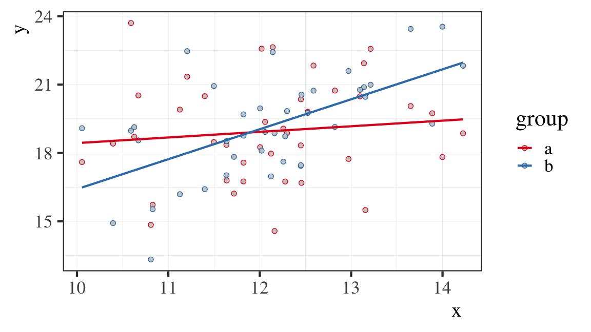
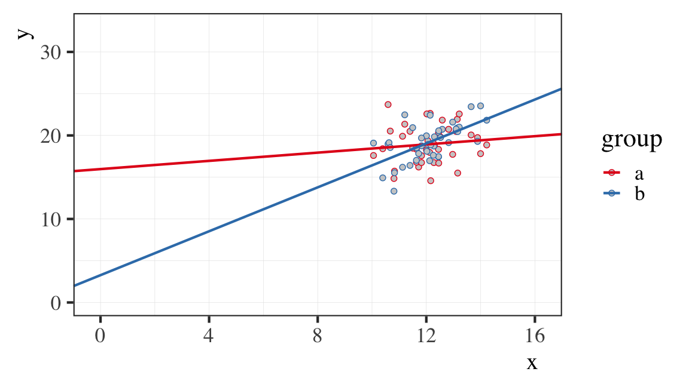
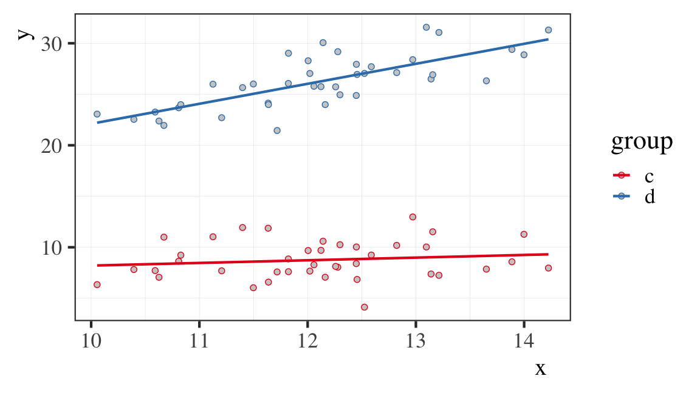
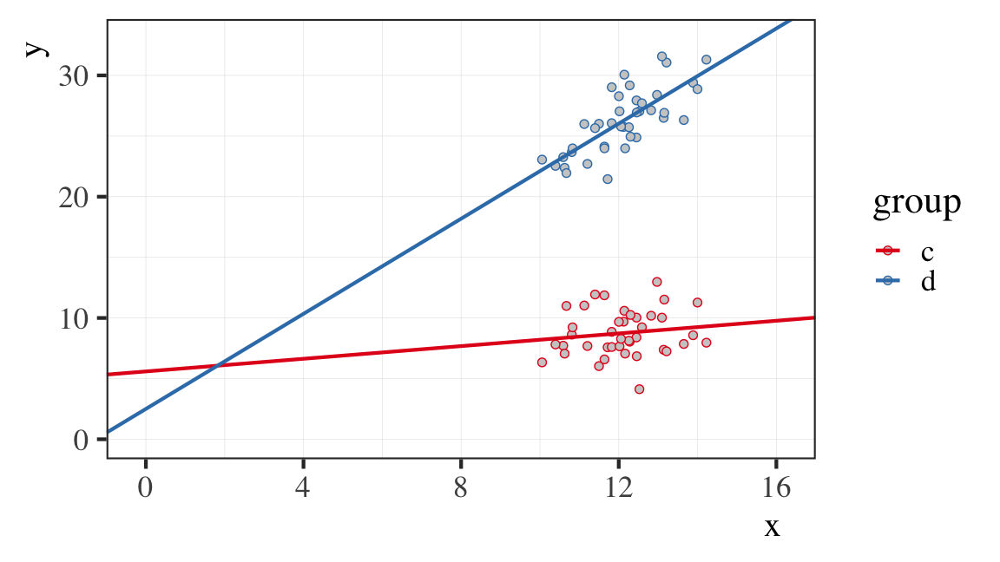

```{r setup, include=FALSE}
options(htmltools.dir.version = FALSE)
```

```{r xaringan-extra-all-the-things, echo=FALSE}
xaringanExtra::use_xaringan_extra(
  c("tile_view", "panelset", "editable" 
    #"scribble", "search", "webcam"
    )
)
```

```{r, 'helpers', echo=FALSE, message=F, warning=F}
source(here::here("slides", "assets", "scripts", "helpers.R"))
source(here("slides", "02_08_model_tuning", "assets", "scripts", "model_tuning.R"))
```

```{r, load_refs, echo=FALSE, cache=FALSE, warning=F, message=F}
bib <- ReadBib(here("slides", "assets", "bib", "ds4ling_refs.bib"), check = FALSE)
ui <- "- "
```

```{r 'global_setup', echo=FALSE}
opts_chunk$set(fig.retina=2, cache=FALSE)
```

class: inverse, middle

<blockquote align='center' class="twitter-tweet" data-lang="de">
<a href="https://twitter.com/tres_gonzaga/status/910822470927523840"></a>
</blockquote>

---
class: title-slide-section-grey, middle

# Fine-tuning and understanding your models

---
layout: true

# Fine-tuning and understanding your models

---

### Overview

1. #### Interactions

2. #### Coding - categorical variables

  - Dummy coding
  - Sum coding
  - Deviation coding

3. #### Transformations - continuous variables

  - Centering
  - Standardizing
  - Log transformation

---
layout: false
class: title-slide-section-red, middle

# Interactions

---
layout: true

# Interactions

---

### What is an interaction?

.content-box-blue[
When the effect of one of the variables on the criterion changes at different 
levels/values of one of the other variables. 
]

- Interactions are possible between continuous variables, continuous *and* 
discontinuous variables, as well as *only* discontinuous variables. 

- It is often the case that a significant interaction will make main effects 
uninterpretable. 

---
background-color: black

### Continuous variables

--

background-image: url(./assets/img/continuous_interaction1.png)
background-position: 70% 50%
background-size: 900px

--

background-image: url(./assets/img/continuous_interaction2.png)
background-position: 70% 50%
background-size: 900px

---

```{r, 'lex_decision_rt', echo=FALSE, fig.width=10.5, fig.height=6, out.extra="style=float:right"}
rt_df %>% 
  ggplot(., aes(x = Familiarity, y = RT, fill = Age)) + 
  geom_point(pch = 21, color = "black", alpha = .3) + 
  geom_smooth(method = lm, size = 2, formula = "y ~ x") + 
  scale_fill_brewer(palette = "Set1") + 
  ds4ling_bw_theme(base_family = 'Times', base_size = 26)
```

### Continuous and</br>categorical variables

---

```{r, 'int1', echo=F, fig.width=10.5, fig.height=6, out.extra="style=float:right"}
tribble(
  ~'Group', ~'Condition', ~'Score', ~'lower', ~'upper', 
   'Early',  'Control',    25,     3.5,      3.5, 
   'Late',   'Control',    25,     3.5,      3.5, 
   'Early',  'Treatment',  25,     3.5,      3.5, 
   'Late',   'Treatment',  25,     3.5,      3.5
) %>% 
  ggplot(., aes(x = Group, y = Score, color = Condition)) + 
    geom_errorbar(aes(ymin = Score - lower, ymax = Score + upper), 
                  width = 0.1, color = 'black') + 
    geom_line(aes(group = Condition), size = c(3, 3, 2.25, 2.25)) + 
    geom_point(pch = 21, fill = 'white', size = 5, stroke = 1) + 
    ylim(0, 50) + 
    scale_color_brewer(palette = "Set1") + 
    theme_test(base_family = 'Times', base_size = 26)
```

### Categorical variables

#### Interaction or no?

--

</img>

---

```{r, 'int2', echo=FALSE, fig.width=10.5, fig.height=6, out.extra="style=float:right"}
tribble(
  ~'Group', ~'Condition', ~'Score', ~'lower', ~'upper', 
   'Early',  'Control',    15,     3.5,      3.5, 
   'Late',   'Control',    35,     3.5,      3.5, 
   'Early',  'Treatment',  15,     3.5,      3.5, 
   'Late',   'Treatment',  35,     3.5,      3.5
) %>% 
  ggplot(., aes(x = Group, y = Score, color = Condition)) + 
    geom_errorbar(aes(ymin = Score - lower, ymax = Score + upper), 
                  width = 0.1, color = 'black') + 
    geom_line(aes(group = Condition), size = c(3, 3, 2.25, 2.25)) + 
    geom_point(pch = 21, fill = 'white', size = 5, stroke = 1) + 
    ylim(0, 50) + 
    scale_color_brewer(palette = "Set1") + 
    theme_test(base_family = 'Times', base_size = 26)
```

### Categorical variables

#### Interaction or no?

--

</img>

---

```{r, 'int3', echo=FALSE, fig.width=10.5, fig.height=6, out.extra="style=float:right"}
tribble(
  ~'Group', ~'Condition', ~'Score', ~'lower', ~'upper', 
   'Early',  'Control',    15,     3.5,      3.5, 
   'Late',  'Control',    15,     3.5,      3.5, 
   'Early',  'Treatment',  35,     3.5,      3.5, 
   'Late',  'Treatment',  35,     3.5,      3.5
) %>% 
  ggplot(., aes(x = Group, y = Score, color = Condition)) + 
    geom_errorbar(aes(ymin = Score - lower, ymax = Score + upper), 
                  width = 0.1, color = 'black') + 
    geom_line(aes(group = Condition), size = c(3, 3, 3, 3)) + 
    geom_point(pch = 21, fill = 'white', size = 5, stroke = 1) + 
    ylim(0, 50) + 
    scale_color_brewer(palette = "Set1") + 
    theme_test(base_family = 'Times', base_size = 26)
```

### Categorical variables

#### Interaction or no?

--

</img>

---

```{r, 'int4', echo=FALSE, fig.width=10.5, fig.height=6, out.extra="style=float:right"}
tribble(
  ~'Group', ~'Condition', ~'Score', ~'lower', ~'upper', 
   'Early',  'Control',    10,     3.5,      3.5, 
   'Late',   'Control',    20,     3.5,      3.5, 
   'Early',  'Treatment',  30,     3.5,      3.5, 
   'Late',   'Treatment',  40,     3.5,      3.5
) %>% 
  ggplot(., aes(x = Group, y = Score, color = Condition)) + 
    geom_errorbar(aes(ymin = Score - lower, ymax = Score + upper), 
                  width = 0.1, color = 'black') + 
    geom_line(aes(group = Condition), size = c(3, 3, 3, 3)) + 
    geom_point(pch = 21, fill = 'white', size = 5, stroke = 1) + 
    ylim(0, 50) + 
    scale_color_brewer(palette = "Set1") + 
    theme_test(base_family = 'Times', base_size = 26)
```

### Categorical variables

#### Interaction or no?

--

</img>

---

```{r, 'int5', echo=FALSE, fig.width=10.5, fig.height=6, out.extra="style=float:right"}
tribble(
  ~'Group', ~'Condition', ~'Score', ~'lower', ~'upper', 
   'Early',  'Control',    15,     3.5,      3.5, 
   'Late',   'Control',    35,     3.5,      3.5, 
   'Early',  'Treatment',  35,     3.5,      3.5, 
   'Late',   'Treatment',  15,     3.5,      3.5
) %>% 
  ggplot(., aes(x = Group, y = Score, color = Condition)) + 
    geom_errorbar(aes(ymin = Score - lower, ymax = Score + upper), 
                  width = 0.1, color = 'black') + 
    geom_line(aes(group = Condition), size = c(3, 3, 3, 3)) + 
    geom_point(pch = 21, fill = 'white', size = 5, stroke = 1) + 
    ylim(0, 50) + 
    scale_color_brewer(palette = "Set1") + 
    theme_test(base_family = 'Times', base_size = 26)
```

### Categorical variables

#### Interaction or no?

--

</img>

---

```{r, 'int6', echo=FALSE, fig.width=10.5, fig.height=6, out.extra="style=float:right"}
tribble(
  ~'Group', ~'Condition', ~'Score', ~'lower', ~'upper', 
   'Early',  'Control',    25,     3.5,      3.5, 
   'Late',   'Control',    25,     3.5,      3.5, 
   'Early',  'Treatment',  10,     3.5,      3.5, 
   'Late',   'Treatment',  40,     3.5,      3.5
) %>% 
  ggplot(., aes(x = Group, y = Score, color = Condition)) + 
    geom_errorbar(aes(ymin = Score - lower, ymax = Score + upper), 
                  width = 0.1, color = 'black') + 
    geom_line(aes(group = Condition), size = c(3, 3, 3, 3)) + 
    geom_point(pch = 21, fill = 'white', size = 5, stroke = 1) + 
    ylim(0, 50) + 
    scale_color_brewer(palette = "Set1") + 
    theme_test(base_family = 'Times', base_size = 26)
```

### Categorical variables

#### Interaction or no?

--

</img>

---

```{r, 'int7', echo=FALSE, fig.width=10.5, fig.height=6, out.extra="style=float:right"}
tribble(
  ~'Group', ~'Condition', ~'Score', ~'lower', ~'upper', 
   'Early',  'Control',    45,     3.5,      3.5, 
   'Late',   'Control',    30,     3.5,      3.5, 
   'Early',  'Treatment',  5,      3.5,      3.5, 
   'Late',   'Treatment',  20,     3.5,      3.5
) %>% 
  ggplot(., aes(x = Group, y = Score, color = Condition)) + 
    geom_errorbar(aes(ymin = Score - lower, ymax = Score + upper), 
                  width = 0.1, color = 'black') + 
    geom_line(aes(group = Condition), size = c(3, 3, 3, 3)) + 
    geom_point(pch = 21, fill = 'white', size = 5, stroke = 1) + 
    ylim(0, 50) + 
    scale_color_brewer(palette = "Set1") + 
    theme_test(base_family = 'Times', base_size = 26)
```

### Categorical variables

#### Interaction or no?

--

</img>

---

```{r, 'int8', echo=F, fig.width=10.5, fig.height=6, out.extra="style=float:right"}
tribble(
  ~'Group', ~'Condition', ~'Score', ~'lower', ~'upper', 
   'Early',  'Control',    45,     3.5,      3.5, 
   'Late',   'Control',    45,     3.5,      3.5, 
   'Early',  'Treatment',  10,     3.5,      3.5, 
   'Late',   'Treatment',  40,     3.5,      3.5
) %>% 
  ggplot(., aes(x = Group, y = Score, color = Condition)) + 
    geom_errorbar(aes(ymin = Score - lower, ymax = Score + upper), 
                  width = 0.1, color = 'black') + 
    geom_line(aes(group = Condition), size = c(3, 3, 3, 3)) + 
    geom_point(pch = 21, fill = 'white', size = 5, stroke = 1) + 
    ylim(0, 50) + 
    scale_color_brewer(palette = "Set1") + 
    theme_test(base_family = 'Times', base_size = 26)
```

### Categorical variables

#### Interaction or no?

--

</img>

---

```{r, 'int_main_effects1', echo=F, fig.width=7, fig.height=6, out.extra="style=float:right"}
tribble(
  ~'Group', ~'Condition', ~'Score', ~'lower', ~'upper', 
   1,  'Control',    45,     3.5,      3.5, 
   2,  'Control',    45,     3.5,      3.5, 
   1,  'Treatment',  10,     3.5,      3.5, 
   2,  'Treatment',  40,     3.5,      3.5
) %>% 
  ggplot(., aes(x = Group, y = Score, color = Condition)) + 
    geom_errorbar(aes(ymin = Score - lower, ymax = Score + upper), 
                  width = 0.05, color = 'black') + 
    geom_line(aes(group = Condition), size = c(3, 3, 3, 3)) + 
    geom_point(size = 6) + 
    geom_point(color = 'white', size = 4) + 
    ylim(0, 50) + 
    scale_color_brewer(palette = "Set1") + 
    scale_x_continuous(breaks = c(1, 2), labels = c('Early', 'Late')) + 
    theme_test(base_family = 'Times', base_size = 26) + 
    theme(legend.position = c(0.8, 0.2))
```

### Interpreting main effects

.pull-left[
- Imagine you fit a model looking at  
`val ~ condition * group` 

- The model yields a main effect of *condition*, *group*, and a *condition* 
$\times$ *group* interaction. 

- Can you interpret the main effects? What does a main effect of *condition* 
mean? What about a main effect of *group*?
]

---

```{r, 'int_main_effects2', echo=F, fig.width=7, fig.height=6, out.extra="style=float:right"}
tribble(
  ~'Group', ~'Condition', ~'Score', ~'lower', ~'upper', 
   1,  'Control',    45,     3.5,      3.5, 
   2,  'Control',    45,     3.5,      3.5, 
   1,  'Treatment',  10,     3.5,      3.5, 
   2,  'Treatment',  40,     3.5,      3.5
) %>% 
  ggplot(., aes(x = Group, y = Score, color = Condition)) + 
    geom_errorbar(aes(ymin = Score - lower, ymax = Score + upper), 
                  width = 0.05, color = 'black', alpha = 0.25) + 
    geom_line(aes(group = Condition), size = c(3, 3, 3, 3), alpha = 0.25) + 
    geom_point(size = 6, alpha = 0.25) + 
    geom_point(color = 'white', size = 4) + 
    geom_point(aes(x = 1.5, y = 45), color = "black", 
               size = 8, fill = 'white', pch = 21, stroke = 2) + 
    geom_point(aes(x = 1.5, y = 25), color = "black", 
               size = 8, fill = 'white', pch = 21, stroke = 2) + 
    ylim(0, 50) + 
    scale_color_brewer(palette = "Set1") + 
    scale_x_continuous(breaks = c(1, 2), labels = c('Early', 'Late')) + 
    theme_test(base_family = 'Times', base_size = 26) + 
    theme(legend.position = c(0.8, 0.2))
```

### Main effect of condition

.pull-left[
- Collapsing over *group*, there is a difference between the *control* and the 
*treatment* conditions, i.e., the difference in means is not 0. 

- Thus, one might interpret the main effect of *condition* as something like 
"Overall, the control group had higher scores than the treatment group". 

- Technically this is "true", but careless, as it does not take into account the 
fact that the treatment had no effect on the `Late` group. 

]

---

```{r, 'int_main_effects3', echo=F, fig.width=7, fig.height=6, out.extra="style=float:right"}
tribble(
  ~'Group', ~'Condition', ~'Score', ~'lower', ~'upper', 
   1,  'Control',    45,     3.5,      3.5, 
   2,  'Control',    45,     3.5,      3.5, 
   1,  'Treatment',  10,     3.5,      3.5, 
   2,  'Treatment',  40,     3.5,      3.5
) %>% 
  ggplot(., aes(x = Group, y = Score, color = Condition)) + 
    geom_errorbar(aes(ymin = Score - lower, ymax = Score + upper), 
                  width = 0.05, color = 'black', alpha = 0.25) + 
    geom_line(aes(group = Condition), size = c(3, 3, 3, 3), alpha = 0.25) + 
    geom_point(size = 6, alpha = 0.25) + 
    geom_point(color = 'white', size = 4) + 
    geom_segment(aes(x = 1, xend = 1, y = 10, yend = 45), lty = 2) + 
    geom_point(aes(x = 1, y = 27.5), 
               size = 8, fill = 'white', pch = 21, stroke = 2) + 
    geom_segment(aes(x = 2, xend = 2, y = 40, yend = 45), lty = 2) + 
    geom_point(aes(x = 2, y = 42.5), 
               size = 8, fill = 'white', pch = 21, stroke = 2) + 
    ylim(0, 50) + 
    scale_color_brewer(palette = "Set1") + 
    scale_x_continuous(breaks = c(1, 2), labels = c('Early', 'Late')) + 
    theme_test(base_family = 'Times', base_size = 26) + 
    theme(legend.position = c(0.8, 0.2))
```

### Main effect of group

.pull-left[
- Collapsing over *condition*, there is a difference between `Early` and `Late`, i.e., the difference in means is not 0. 

- Thus, one might interpret the main effect as something like 
"Overall, the late group had higher average scores than the early group". 

- Technically this is "true", but careless, as it does not take into account the 
fact that the treatment is only effective on the `Early` group. 
]

---

### Three-way interactions `r emojifont::emoji('sweat_smile')`

```{r, 'three_way_int1', echo=FALSE, fig.width=7, fig.height=6}
tribble(
  ~'Group', ~'Condition', ~'Score', ~'lower', ~'upper', 
   1,  'Control',    45,     3.5,      3.5, 
   2,  'Control',    45,     3.5,      3.5, 
   1,  'Treatment',  10,     3.5,      3.5, 
   2,  'Treatment',  40,     3.5,      3.5
) %>% 
  ggplot(., aes(x = Group, y = Score, color = Condition)) + 
    geom_errorbar(aes(ymin = Score - lower, ymax = Score + upper), 
                  width = 0.05, color = 'black') + 
    geom_line(aes(group = Condition), size = c(3, 3, 3, 3), show.legend = F) + 
    geom_point(size = 6, show.legend = F) + 
    geom_point(color = 'white', size = 4) + 
    ylim(0, 50) + 
    xlab("American") + 
    scale_color_brewer(palette = "Set1") + 
    scale_x_continuous(breaks = c(1, 2), labels = c('Early', 'Late')) + 
    theme_test(base_family = 'Times', base_size = 26)

tribble(
  ~'Group', ~'Condition', ~'Score', ~'lower', ~'upper', 
   1,  'Control',    45,     3.5,      3.5, 
   2,  'Control',    45,     3.5,      3.5, 
   1,  'Treatment',  10,     3.5,      3.5, 
   2,  'Treatment',  40,     3.5,      3.5
) %>% 
  ggplot(., aes(x = Group, y = Score, color = Condition)) + 
    geom_errorbar(aes(ymin = Score - lower, ymax = Score + upper), 
                  width = 0.05, color = 'black') + 
    geom_line(aes(group = Condition), size = c(3, 3, 3, 3)) + 
    geom_point(size = 6) + 
    geom_point(color = 'white', size = 4) + 
    xlab("British") + 
    scale_color_brewer(palette = "Set1") + 
    scale_x_continuous(breaks = c(1, 2), labels = c('Early', 'Late')) + 
    scale_y_continuous(limits = c(0, 50), position = 'right') + 
    theme_test(base_family = 'Times', base_size = 26) + 
    theme(legend.position = c(0.8, 0.2))
```

---
layout: false
background-image: url(https://media.giphy.com/media/3ofSB8NFxyfY6jw2Jy/giphy.gif)
background-size: contain

---

# Interactions

### Three-way interactions `r emojifont::emoji('expressionless')`

```{r, 'three_way_int2', echo=FALSE, fig.width=7, fig.height=6}
tribble(
  ~'Group', ~'Condition', ~'Score', ~'lower', ~'upper', 
   1,  'Control',    45,     3.5,      3.5, 
   2,  'Control',    45,     3.5,      3.5, 
   1,  'Treatment',  10,     3.5,      3.5, 
   2,  'Treatment',  40,     3.5,      3.5
) %>% 
  ggplot(., aes(x = Group, y = Score, color = Condition)) + 
    geom_errorbar(aes(ymin = Score - lower, ymax = Score + upper), 
                  width = 0.05, color = 'black') + 
    geom_line(aes(group = Condition), size = c(3, 3, 3, 3), show.legend = F) + 
    geom_point(size = 6, show.legend = F) + 
    geom_point(color = 'white', size = 4) + 
    ylim(0, 50) + 
    xlab("American") + 
    scale_color_brewer(palette = "Set1") + 
    scale_x_continuous(breaks = c(1, 2), labels = c('Early', 'Late')) + 
    theme_test(base_family = 'Times', base_size = 26)

tribble(
  ~'Group', ~'Condition', ~'Score', ~'lower', ~'upper', 
   1,  'Control',    45,     3.5,      3.5, 
   2,  'Control',    45,     3.5,      3.5, 
   1,  'Treatment',  33,     3.5,      3.5, 
   2,  'Treatment',  18,     3.5,      3.5
) %>% 
  ggplot(., aes(x = Group, y = Score, color = Condition)) + 
    geom_errorbar(aes(ymin = Score - lower, ymax = Score + upper), 
                  width = 0.05, color = 'black') + 
    geom_line(aes(group = Condition), size = c(3, 3, 3, 3)) + 
    geom_point(size = 6) + 
    geom_point(color = 'white', size = 4) + 
    xlab("British") + 
    scale_color_brewer(palette = "Set1") + 
    scale_x_continuous(breaks = c(1, 2), labels = c('Early', 'Late')) + 
    scale_y_continuous(limits = c(0, 50), position = 'right') + 
    theme_test(base_family = 'Times', base_size = 26) + 
    theme(legend.position = c(0.8, 0.2))
```

---
background-image: url(https://i.imgflip.com/26x5rs.jpg)
background-size: contain

---
layout: false
class: title-slide-section-red, middle

# Coding categorical variables

---
layout: true

# Coding categorical variables

---

### Overview

.pull-left[

- One of the benefits of 'doing ANOVA' with MRC is that you can include 
different types of predictors in your model, i.e., **categorical** and 
.blue[continuous].

- Neither classical ANOVA nor classical MRC can handle combinations of these 
two predictors

- This is possible because of dummy coding

- But there are other methods of coding categorical variables
]

--

.pull-right[

- Treatment (dummy) coding

- Sum coding

- Deviation coding

- ...and others

]

---
class: title-slide-section-grey, middle

## .RUred[Treatment coding]

---

### Treatment (dummy) coding

#### You get j-1 dummies

.Large[

| Groups | d<sub>1</sub> | d<sub>2</sub> | d<sub>3</sub> |
| :----- | :-----------: | :-----------: | :-----------: |
| A      | 0             | 0             | 0             |
| B      | 1             | 0             | 0             |
| C      | 0             | 1             | 0             |
| D      | 0             | 0             | 1             |

]

---

### Treatment (dummy) coding

#### One level is taken as the *reference* or *baseline*. This is the intercept.

.Large[

| Groups | d<sub>1</sub> | d<sub>2</sub> | d<sub>3</sub> |                  |
| :----- | :-----------: | :-----------: | :-----------: | :--------------- |
| **A**  | **0**         | **0**         | **0**         | ⬅︎ **Intercept** |
| B      | 1             | 0             | 0             |                  |
| C      | 0             | 1             | 0             |                  |
| D      | 0             | 0             | 1             |                  |

]

---

### Treatment (dummy) coding

#### j-1 dummies = j-1 comparisons

.Large[

| Groups   | d<sub>1</sub> | d<sub>2</sub> | d<sub>3</sub> |                  |
| :------- | :-----------: | :-----------: | :-----------: | :--------------- |
| **A**    | **0**         | **0**         | **0**         | ⬅︎ **Intercept** |
| .blue[B] | .blue[1]      | 0             | 0             |                  |
| C        | 0             | 1             | 0             |                  |
| D        | 0             | 0             | 1             |                  |
|          | ⬆︎</br>**A**.blue[B]|         |               |                  |
]

---

### Treatment (dummy) coding

#### j-1 dummies = j-1 comparisons

.Large[

| Groups   | d<sub>1</sub> | d<sub>2</sub> | d<sub>3</sub> |                  |
| :------- | :-----------: | :-----------: | :-----------: | :--------------- |
| **A**    | **0**         | **0**         | **0**         | ⬅︎ **Intercept** |
| B        | 1             | 0             | 0             |                  |
| .blue[C] | 0             | .blue[1]      | 0             |                  |
| D        | 0             | 0             | 1             |                  |
|          |               | ⬆︎</br>**A**.blue[C]|         |                  |
]

---

### Treatment (dummy) coding

#### j-1 dummies = j-1 comparisons

.Large[

| Groups   | d<sub>1</sub> | d<sub>2</sub> | d<sub>3</sub> |                  |
| :------- | :-----------: | :-----------: | :-----------: | :--------------- |
| **A**    | **0**         | **0**         | **0**         | ⬅︎ **Intercept** |
| B        | 1             | 0             | 0             |                  |
| C        | 0             | 1             | 0             |                  |
| .blue[D] | 0             | 0             | .blue[1]      |                  |
|          |               |               | ⬆︎</br>**A**.blue[D] |           |
]

---

### Review - Spanish spirantization

- We are going to look at L2 acquisition of Spanish voiced stops

- Spanish voiced stops: /b, d, g/
  - Stop/approximant alternation: /b, d, g/ → [β, ð, ɣ]
  - Believed to be underlyingly stops (but this is contested)
  - Surface as stops in utterance initial position, after nasals, and after /l/ 
  in the case of /d/
  - Approximants in all other contexts

- We have data from 30 participants (15 natives, 15 L2 learners) who produced 
/b/ in utterance initial and intervocalic position

- We are interested in measuring degree of spirantization to see if learners 
can acquire a new phonetic category, [β]

- Spirantization can be quantified by measuring the relative difference in the 
intensity (dB) of the target segment and that of the following vowel

---

```{r, 'spirantization_p1', echo=FALSE, fig.height=6.5, fig.width=7, out.extra="style='float:right'"}
ggplot(spir_tidy, aes(x = group, y = intensity_diff, fill = group)) + 
  geom_boxplot(show.legend = F) + 
  scale_fill_brewer(palette = "Purples") + 
  ds4ling_bw_theme()
```

### Treatment (dummy) coding - Spanish spirantization

.pull-left[

- We will fit a model that analyzes the `intensity difference` for the target 
segment ([β]) as a function group (native, learner)

```{r, 'spirantization_table1', echo=FALSE}
spir_tidy %>% 
  group_by(., group) %>% 
  summarize(., mean_int_diff = mean(intensity_diff), 
            sd_int_diff = sd(intensity_diff)) %>% 
  kable(., format = 'html', digits = 3) %>% 
  kable_styling(., full_width = FALSE, font_size = 18)
```

```{r, 'spirantization_mod_fake', cache=FALSE, eval=FALSE}
lm(intensity_diff ~ group, data = spir_tidy)
```

```{r, 'spirantization_mod_output1', echo=FALSE, cache=FALSE}
mod_spir1 <- lm(intensity_diff ~ group, data = spir_tidy)
mod_spir1 %>% 
  tidy(.) %>% 
  kable(., format = 'html', digits = 3) %>% 
  kable_styling(., full_width = FALSE, font_size = 18)
```

]

---

```{r, 'spirantization_p2', echo=FALSE, fig.height=6.5, fig.width=6.5, out.extra="style='float:right'"}
spir_tidy %>% 
  mutate(., prof = fct_relevel(prof, "beg", "adv", "nat")) %>%
ggplot(., aes(x = prof, y = intensity_diff, fill = group)) + 
  geom_boxplot(show.legend = F) + 
  scale_fill_brewer() + 
  ds4ling_bw_theme()
```

### Treatment (dummy) coding - Spanish spirantization

.pull-left[

- If the categorical predictor includes more than one level

```{r, 'spirantization_table2', echo=FALSE}
spir_tidy %>% 
  mutate(., prof = fct_relevel(prof, "nat")) %>% 
  group_by(., prof) %>% 
  summarize(., mean_int_diff = mean(intensity_diff), 
            sd_int_diff = sd(intensity_diff)) %>% 
  kable(., format = 'html', digits = 3) %>% 
  kable_styling(., full_width = FALSE, font_size = 18)
```

```{r, 'spirantization_mod_fake2', echo=TRUE, cache=FALSE, eval=FALSE}
lm(intensity_diff ~ prof, data = spir_tidy)
```

```{r, 'spirantization_mod_table2', echo=FALSE, cache=FALSE}
mod_spir2 <- spir_tidy %>% 
  mutate(., prof = fct_relevel(prof, "nat")) %>% 
  lm(intensity_diff ~ prof, data = .)
mod_spir2 %>% 
  tidy(.) %>% 
  kable(., format = 'html', digits = 3) %>% 
  kable_styling(., full_width = FALSE, font_size = 18)
```

]

---

### Treatment (dummy) coding - Spanish spirantization

- If we want to test other comparisons we have to `relevel()` the factor. 

```{r, 'spirantization_mod_table3', echo=TRUE, cache=FALSE}
mod_spir3 <- spir_tidy %>% 
  mutate(., prof = fct_relevel(prof, "beg")) %>% #<<
  lm(intensity_diff ~ prof, data = .)
mod_spir3 %>% 
  tidy(.) %>% 
  kable(., format = 'html', digits = 3) %>% 
  kable_styling(., full_width = FALSE, font_size = 22)
```

---

### Treatment (dummy) coding - Summary

#### Advantages

- Easy to do (default in R and most stats programs)

- Easy to interpret if you know reference level and model is not too complicated

#### Disadvantages

- May give meaningless comparisons without releveling factor

- May give meaningless comparisons if model includes continuous predictor

---
class: title-slide-section-grey, middle

## .RUred[Sum coding]

---

### Sum coding

- As we have seen, treatment coded dummy variables are discontinuous predictors 
coded as 0/1

- We can also use other values to get different model outputs

- **Sum coding** (or "effect" coding) is often used when one wants the default 
model output to use an overall average value as the reference (rather than a 
possibly arbitrarily chosen group)

- The values of the coded vectors must *sum to 0*

- We still get j-1 estimates

---

### Sum coding

#### How do we do it?

- If our discontinuous variable only has two levels, we can add a new column to 
the dataframe that includes -1/1

- We can do this easily using the `mutate()` function

```{r, 'fake_sum_contrast_mutate', eval=FALSE}
spir_tidy %>% 
  mutate(., groupSum = if_else(group == "native", true = 1, false = -1)) #<<
```

```{r, spir_tidy_head, echo=FALSE}
spir_tidy %>% 
  select(., -groupDev, -int_diff_c) %>% 
  head(., 3) %>% 
  kable(., format = 'html', row.names = TRUE) %>% 
  kable_styling(., font_size = 18)
```

```{r, spir_tidy_tail, echo=FALSE}
spir_tidy[, !(names(spir_tidy) %in% c('groupDev', 'int_diff_c', 'profSum'))] %>% 
  tail(., 3) %>% 
  kable(., format = 'html', row.names = TRUE) %>% 
  kable_styling(., font_size = 18)
```

---
background-image: url(./index_files/figure-html/spirantization_p1-1.png)
background-position: 100% 50%
background-size: 500px

### Sum coding - Spanish spirantization

.pull-left[

```{r, 'spirantization_sum_mod_fake', echo=TRUE, eval=FALSE}
lm(intensity_diff ~ groupSum, data = spir_tidy)
```

```{r, 'spirantization_sum_coding_mod', echo=FALSE}
mod_spir_sum <- lm(intensity_diff ~ groupSum, data = spir_tidy)
mod_spir_sum %>% 
  tidy(.) %>% 
  kable(., format = 'html', digits = 3) %>% 
  kable_styling(., full_width = FALSE, font_size = 18)
```

]

--

.footnote[

```{r, 'spirantization_table1_repeat', echo=FALSE}
spir_tidy %>% 
  group_by(., group) %>% 
  summarize(., mean_int_diff = mean(intensity_diff), 
            sd_int_diff = sd(intensity_diff)) %>% 
  kable(., format = 'html', digits = 3) %>% 
  kable_styling(., full_width = FALSE, font_size = 18)
```

- What is the intercept? The mean of group means.

- What is `groupSum`? The effect of group on the intercept. 

- Calculate the intercept +/- the `groupSum` effect = group means.

]

---
background-image: url(./index_files/figure-html/spirantization_p2-1.png)
background-position: 90% 35%
background-size: 500px

### Sum coding - Spanish spirantization

.pull-left[

- What about with a 3-level factor?
- This requires more tweeking.

```{r, 'spirantization_set_sum', echo=TRUE}
spir_tidy$prof <- as.factor(spir_tidy$prof)
spir_tidy$profSum <- C(spir_tidy$prof, sum) #<<
contrasts(spir_tidy$profSum)
```

```{r, 'spirantization_sum_mod_fake2', echo=TRUE, eval=FALSE}
lm(intensity_diff ~ profSum, data = spir_tidy) 
```

```{r, 'spirantization_sum_coding_prof_mod', echo=FALSE}
mod_spir_prof_sum <- lm(intensity_diff ~ profSum, data = spir_tidy)
mod_spir_prof_sum %>% 
  tidy(.) %>% 
  kable(., format = 'html', digits = 3) %>% 
  kable_styling(., full_width = FALSE, font_size = 18)
```

]

--

.pull-right[
.footnote[
- Is this useful? Why would we do this?
- We'll come back to this (10 minutes)
]
]

---

### Sum coding - Summary

#### Advantages

- With two level factor, sum (effect) coding gives omnibus assessment of main 
effects

- With more than two levels, sum (effect) coding assess the "uniqueness" of a 
given level compared to the overall average

- Avoids (possibly) arbitrary selection of reference group

- Makes MRC even more like ANOVA (advantage for researchers accustomed to ANOVA)

#### Disadvantages

- Involves releveling, adding columns to dataframe or resetting factor

- May not always provide useful information? 

---
class: title-slide-section-grey, middle

## .RUred[Deviation coding]

---
layout: true

# Coding categorical variables

---

### Deviation coding

- Dummy variables of discontinuous predictors can be coded as 0/1 (treatment 
coding) or -1/1 (sum coding)

- There is another *sum to 0* possibility that is often used with 2-level 
factors: deviation coding

- **Deviation coding** is often used when one wants the default 
model output to provide an overall assessment of effect size. 

- The values of the coded vectors still must *sum to 0*

- We still get j-1 estimates

---

### Deviation coding

#### How do we do it?

- We can add a new column to the dataframe that includes -0.5/0.5

- We can do this easily using the `mutate()` function

```{r, 'fake_sum_contrast_mutate2', eval=FALSE}
spir_tidy %>% 
  mutate(., groupDev = if_else(group == "native", true = 0.5, false = -0.5)) #<<
```

```{r, spir_tidy_head2, echo=FALSE}
spir_tidy %>% 
  select(., -groupSum, -profSum, -int_diff_c) %>% 
  head(., 3) %>% 
  kable(., format = 'html', row.names = TRUE) %>% 
  kable_styling(., font_size = 18)
```

```{r, spir_tidy_tail2, echo=FALSE}
spir_tidy[, !(names(spir_tidy) %in% c('groupSum', 'profSum', 'int_diff_c'))] %>% 
  tail(., 3) %>% 
  kable(., format = 'html', row.names = TRUE) %>% 
  kable_styling(., font_size = 18)
```

---
background-image: url(./index_files/figure-html/spirantization_p1-1.png)
background-position: 100% 50%
background-size: 500px

### Deviation coding - Spanish spirantization

.pull-left[

```{r, 'spirantization_dev_mod_fake', echo=TRUE, eval=FALSE}
lm(intensity_diff ~ groupDev, data = spir_tidy)
```

```{r, 'spirantization_dev_coding_mod', echo=FALSE}
mod_spir_dev <- lm(intensity_diff ~ groupDev, data = spir_tidy)
mod_spir_dev %>% 
  tidy(.) %>% 
  kable(., format = 'html', digits = 3) %>% 
  kable_styling(., full_width = FALSE, font_size = 18)
```

]

--

.footnote[

```{r, 'spirantization_table1_repeat2', echo=FALSE}
spir_tidy %>% 
  group_by(., group) %>% 
  summarize(., mean_int_diff = mean(intensity_diff), 
            sd_int_diff = sd(intensity_diff)) %>% 
  kable(., format = 'html', digits = 3) %>% 
  kable_styling(., full_width = FALSE, font_size = 18)
```

- What is the intercept? The mean of group means.

- What is `groupDev`? The overall effect of group. 

- Calculates the difference between group means

]

---

### Deviation coding - Summary

#### Advantages

- Deviation coding gives omnibus assessment of main effects

- Avoids (possibly) arbitrary selection of reference group

- Makes MRC even more like ANOVA (advantage for researchers accustomed to ANOVA)

#### Disadvantages

- Involves releveling, adding columns to dataframe or resetting factor

- May not always provide useful information? 

- Doesn't take advantage of the intercept 

---
layout: false
background-color: lightblue

# A note about ANOVA

.pull-left[
#### MRC

```{r, mrc_anova, echo=FALSE, comment=NA}
summary(mod_spir_sum)
```

]

--

.pull-right[

#### ANOVA

</br>

```
aov(intensity_diff ~ groupSum, data = spir_tidy)
```

```{r, anova_mrc, echo=FALSE, comment=NA}
aov_prof <- aov(intensity_diff ~ groupSum, data = spir_tidy)
summary(aov_prof)
```

.footnote[
.content-box-red[
Notice: the F-ratio and DFs
]
]
]

---
background-color: lightblue

# A note about ANOVA

### We can make them exactly the same...

.pull-left[
#### MRC

```{r, mrc_anova2, comment=NA}
anova(mod_spir_sum)
```

]

.pull-right[

#### ANOVA

```{r, anova_mrc2, comment=NA}
summary(aov_prof)
```

]

---
background-color: lightblue

# A note about ANOVA

.pull-left[
#### T-test

```{r, 'ttest_anova_mrc', comment=NA}
t.test(intensity_diff ~ group, data = spir_tidy)
```
]

.pull-right[

#### MRC

```{r, 'mrc_anova3', comment=NA}
summary(mod_spir_sum)$coef
```

</br>

#### ANOVA

```{r, 'anova_mrc3', comment=NA}
summary(aov_prof)
```

]

---
background-color: lightblue

# A note about ANOVA

### What it means

- With a 1-way between-subjects design, MRC, ANOVA and the t-test essentially 
do the exact same thing

- This is because they are all part of the general linear model (remember when 
I said 'everything is a linear model'?)

- ANOVA and t-tests **require** categorical factors

- T-test can only compare two groups (1 factor, 2 levels)

- ANOVA can include many categorical factors with numerous levels

- Neither the t-test nor ANOVA can model continuous predictors

- MRC includes continuous and discontinuous predictors and gives us more 
information...
  - Parameter estimates
  - Comparisons
  - R<sup>2</sup>

---
class: title-slide-section-grey, middle

# Coding categorical predictors

## .RUred[Contrast coding]

---
layout: true

# Coding categorical predictors

---

### Contrast coding

- Ideally we want to avoid tests that are not theoretically motivated
  1. Because they are not interesting
  2. To avoid capitalizing on chance

- One way to avoid atheoretical comparisons is to use orthogonal contrast 
coding

- This mean the researcher specifies the contrasts to test by hand-coding the 
dummy vector

- For example, imagine we want to test the `adv` group with the native controls, 
as well as the `beg` and `adv` learner groups together with the natives.

--

.pull-left[

.center[**Adv. vs. Natives**]

```{r, 'contrast_means1', echo=FALSE}
spir_tidy %>% 
  dplyr::filter(., prof != 'beg') %>%
  group_by(., prof) %>% 
  summarize(., mean_int_diff = mean(intensity_diff)) %>% 
  kable(., format = 'html', digits = 3) %>% 
  kable_styling(., full_width = FALSE, font_size = 18)
```
]

.pull-right[

.center[**Learners vs. Natives**]

```{r, 'contrast_means2', echo=FALSE}
spir_tidy %>% 
  group_by(., group) %>% 
  summarize(., mean_int_diff = mean(intensity_diff)) %>% 
  kable(., format = 'html', digits = 3) %>% 
  kable_styling(., full_width = FALSE, font_size = 18)
```
]

---

### Contrast coding

.left-column[

1. Manually code contrasts
1. Put them in a matrix
1. Calculate general inverse of matrix
1. Fit model using `contrasts` argument

```{r, 'contrast_means3', echo=FALSE}
spir_tidy %>% 
  dplyr::filter(., prof != 'beg') %>%
  group_by(., prof) %>% 
  summarize(., mean_int_diff = mean(intensity_diff)) %>% 
  kable(., format = 'html', digits = 3) %>% 
  kable_styling(., full_width = FALSE, font_size = 18)
```

```{r, 'contrast_means4', echo=FALSE}
spir_tidy %>% 
  group_by(., group) %>% 
  summarize(., mean_int_diff = mean(intensity_diff)) %>% 
  kable(., format = 'html', digits = 3) %>% 
  kable_styling(., full_width = FALSE, font_size = 18)
```

]

.right-column[

```{r, 'contrast_setup', echo=TRUE}
contrast1 <- c(1,     0, -1) # adv       vs. native
contrast2 <- c(1/2, 1/2, -1) # adv + beg vs. native
prof_contrasts <- matrix(c(contrast1, contrast2), ncol = 2)
prof_contrasts <- t(MASS::ginv(prof_contrasts))
show(prof_contrasts)
```

```
lm(intensity_diff ~ prof, data = spir_tidy, contrasts = list(prof = prof_contrasts))
```

```{r, 'contrast_mod', echo=FALSE}
mod_spir_contrast <- lm(intensity_diff ~ prof, data = spir_tidy, 
                        contrasts = list(prof = prof_contrasts))
mod_spir_contrast %>% 
  tidy(.) %>%
  kable(., format = 'html', digits = 4) %>% 
  kable_styling(., full_width = FALSE, font_size = 17)
```
]

---

### Contrast coding - Summary

#### Advantages

- Allows you to test only the comparisons you want

- Test only theoretically motivated comparisons

#### Disadvantages

- Requires thought, coding by hand

- What is the benefit of estimating the intercept?

---
layout: false
class: title-slide-section-red, middle

# Transforming continuous predictors

---
layout: true

# Transforming continuous predictors

---

### Overview

- What is a transformation?  
The process of converting data from one format to another

- We can use linear and non-linear transformations to make our models more 
interpretable (especially in conjunction with coding discontinuous predictors)

- Transformations do not affect the model fit, predictions, R<sup>2</sup>, etc. 

- The goal is to make our model easier to understand

<p></p>

- Examples
  - Log transformation
  - Centering
  - Standardizing

---
class: title-slide-section-grey, middle

## .RUred[Log transformations]

---

### Log transformations

#### What?

- A log transformation converts the predictor to a non-linear logarithmic scale

- A log scale is one that is based on orders of magnitude

- The value of each 'tick' on the scale is the value of the previous 'tick' 
multiplied by a base value

<p></p>

- Some naturally occurring phenomena are better understood in a logarithmic 
scale 
  - Seismic activity (Richter scale)
  - Sound (loudness, dB)
  - Odds (logits)

#### Why?

- A log transformation can make a predictor variable more normal (i.e., correct 
for skewness)

- Log scales show percent change in an easily interpretable manner

---
layout: false
class: middle

.pull-left[

</br></br></br></br></br>

```{r, 'sound_ex', echo=FALSE}
sound_info <- tribble(
  ~'Typical experience', ~'Pressure (μPa)', ~'Decibel level', 
   'Absolute threshold',                20,                0, 
   'Faint whisper',                    200,               20, 
   'Quiet office',                    2000,               40, 
   'Conversation',                   20000,               60, 
   'City bus',                      200000,               80, 
   'Subway train',                 2000000,              100, 
   'Loud thunder',                20000000,              120, 
   'Pain and damage',            200000000,              140)

sound_info %>%
  mutate(., `Pressure (μPa)` = format(`Pressure (μPa)`, scientific = F)) %>% 
  kable(., format = 'html', align = c("l", "r", "r")) %>% 
  kable_styling(., font_size = 18, position = 'left')
```
]

.pull-right[

```{r, 'sound_ex_plot', echo=FALSE, fig.height=9}
db1 <- tibble(x = seq(0, 2000000, length.out = 101), 
       y = 0:100) %>% 
  ggplot(., aes(x = x, y = y)) + 
    geom_line(size = 2) + 
    labs(x = "Pressure (μPa)", y = "Theoretical linear relationship") + 
    ds4ling_bw_theme()
db2 <- tibble(x = seq(0, 2000000, length.out = 101), 
       y = log10(0:100)) %>% 
  ggplot(., aes(x = x, y = y)) + 
    geom_line(size = 2) + 
    labs(x = "Pressure (μPa)", y = "Decibel level") + 
    scale_y_continuous(breaks = seq(0, 2, 0.40), labels = seq(0, 100, 20)) +
    ds4ling_bw_theme()

db1 / db2
```
]

---
layout: true

# Transforming continuous predictors

---

### Log transformations

.pull-left[

- It is most common to use the natural log (log<sub>e</sub>)<sup>1</sup>

- The values must be positive in order to be log-transformed

- We can do it in R with the `log()` function

- Consider the `language_diversity` data

```{r, 'tidy_lang_div', echo=TRUE}
tidy_lang_div <- language_diversity %>% 
  dplyr::filter(., Continent != 'Americas') %>% 
  spread(., Measurement, Value) %>% 
  select(., Country, MGS, Langs) %>% 
  mutate(., log_langs = log(Langs)) #<<
```

]


```{r, 'lang_div_hists', echo=FALSE, fig.height=3, fig.width=6, fig.align='right'}
hist(tidy_lang_div$Langs)
hist(tidy_lang_div$log_langs)
```

.footnote[.scriptsize[<sup>1</sup> A mathematical constant, irrational and transcendental number equal to ~ 2.718281828459]]

---

#### Log transformations

.pull-left[

```{r, 'lang_div_plots1', echo=FALSE, fig.height=4.5, warning=F, message=F}
tidy_lang_div %>% 
  ggplot(., aes(x = MGS, y = Langs, label = Country)) + 
    geom_point() + 
    geom_text_repel(segment.colour = NA) +
    geom_smooth(method = lm, se = F, formula = "y ~ x") + 
    scale_x_continuous(breaks = 0:12, labels = 0:12) + 
    labs(x = "Mean Growing Season", caption = "") + 
    theme_test()
```

```{r, 'lang_div_mod', echo=FALSE}
tidy_lang_div %>% 
  lm(Langs ~ MGS, data = .) %>% 
  tidy(.) %>% 
  kable(., format = 'html') %>% 
  kable_styling(font_size = 14)
```
]

--

.pull-right[

```{r, 'lang_div_plots2', echo=FALSE, fig.height=4.5, warning=F, message=F}
tidy_lang_div %>% 
  ggplot(., aes(x = MGS, y = log_langs, label = Country)) + 
    geom_point() + 
    geom_text_repel(segment.colour = NA) +
    geom_smooth(method = lm, se = F, formula = "y ~ x") + 
    scale_x_continuous(breaks = 0:12, labels = 0:12) + 
    scale_y_continuous(position = "right") + 
    labs(x = "Mean Growing Season", caption = "Fig. 2 from Nettle (1998)") + 
    theme_test()
```

```{r, 'lang_div_log_mod', echo=FALSE}
tidy_lang_div %>% 
  lm(log_langs ~ MGS, data = .) %>% 
  tidy(.) %>% 
  kable(., format = 'html') %>% 
  kable_styling(font_size = 14)
```

.tiny[
- A 1 month change in MGS is associated with a 22% increase in the number of 
languages.
]
]

---

### Log transformations - Summary

#### Advantages

- Can correct for skewness (note: this is not a guaranteed fix for non-normal 
data)

<p></p>

- Fairly easy to interpret
  - Coefficients with low values can be interpreted directly as percents
  - Coefficients with higher values should be exponentiated (`exp()`)

<p></p>

- If the criterion *and* the predictors are log transformed, parameter estimates 
interpreted as "for each 1% change in x, the predicted difference in y is \_\_%"

---
class: title-slide-section-grey, middle

## .RUred[Centering]

---
exclude: true

```{r, 'fit_ex_ab_mods', echo=FALSE}
#
# Fit models
#

# Example A
# Dummy coded factor and continuous predictor
mod_a_uncen_treat <- lm(y ~ group * x, data = ex_a)

# Sum coded factor and continuous predictor
mod_a_uncen_sum <- lm(y ~ groupSum * x, data = ex_a)

# Dummy coded factor and centered predictor
mod_a_cen_treat <- lm(y ~ group * x_c, data = ex_a)

# Sum coded factor and centered predictor
mod_a_cen_sum <- lm(y ~ groupSum * x_c, data = ex_a)

# Sum coded factor and standardized predictor/criterion
mod_a_std_std <- lm(y_std ~ groupSum * x_std, data = ex_a)


# Example B
# Dummy coded factor and continuous predictor
mod_b_uncen_treat <- lm(y ~ group * x, data = ex_b)

# Sum coded factor and continuous predictor
mod_b_uncen_sum   <- lm(y ~ groupSum * x, data = ex_b)

# Dummy coded factor and centered predictor
mod_b_cen_treat <- lm(y ~ group * x_c, data = ex_b)

# Sum coded factor and centered predictor
mod_b_cen_sum <- lm(y ~ groupSum * x_c, data = ex_b)

# Sum coded factor and standardized predictor/criterion
mod_b_std_std <- lm(y_std ~ groupSum * x_std, data = ex_b)

```

---

### Centering

.pull-left[

- As mentioned previously, the intercepts in many of our models are not 
meaningful
  - This is particularly true when the average of a continuous predictor is far 
  from 0
  - Or when having a value of 0 makes no sense, i.e., IQ, vocab size, etc.

<p></p>

- An easy way to fix this is to center the predictor

- A centered predictor has a mean of 0

- The standard deviation remains the same

- To center a predictor you subtract the mean from each value

]

--

.pull-right[

```{r, 'centering_mutate_ex', eval=TRUE, comment=NA}
mtcars %>% 
  mutate(., disp_c = disp - mean(disp)) %>% #<<
  summarize(., mean_disp = mean(disp) %>% round(., 2), 
               sd_disp = sd(disp) %>% round(., 2), 
               mean_disp_c = mean(disp_c) %>% round(., 2), 
               sd_disp_c = sd(disp_c) %>% round(., 2)) %>% 
  t(.) 
```
]

---

### Centering - Ex. A

```{r, 'uncentered_plot_a', echo=FALSE, fig.height=4.5, fig.width=8, include=FALSE}
ex_a %>% 
  ggplot(., aes(x, y, color = group)) + 
    geom_point(pch = 21, fill = "grey80", size = 2) + 
    scale_color_brewer(palette = "Set1") + 
    geom_smooth(method = lm, se = F, formula = "y ~ x") + 
    ds4ling_bw_theme(base_family = "Times", base_size = 22)
```

```{r, 'uncentered_plot_a_extend', echo=FALSE, fig.height=4.5, fig.width=8, include=FALSE}
ex_a %>% 
  ggplot(., aes(x, y, color = group)) + 
    geom_point(pch = 21, fill = "grey80", size = 2) + 
    scale_color_brewer(palette = "Set1") + 
    geom_smooth(method = lm, se = F, fullrange = T, formula = "y ~ x") + 
    scale_x_continuous(breaks = seq(0, 20, 4), expand = c(0, 0), 
                       limits = c(-1, 17)) + 
    coord_cartesian(ylim = c(0, 33)) + 
    ds4ling_bw_theme(base_family = "Times", base_size = 22)
```

<div style="float:left">

</div>

--

<div style="float:right">

</div>

.center[
```{r, 'mod_a_uncen_treat', echo=FALSE, comment=NA}
tidy(mod_a_uncen_treat) %>% 
  kable(., format = 'html', digits = 3) %>% 
  kable_styling(font_size = 18)
```
]

---
background-image: url(./index_files/figure-html/centered_plot_a-1.png)
background-position: 50% 50%
background-size: 800px

### Centering - Ex. A

```{r, 'centered_plot_a', echo=FALSE, fig.height=5, fig.width=10, cache=FALSE, include=FALSE}
p_a <- ex_a %>% 
  ggplot(., aes(x, y, color = group)) + 
    geom_point(shape = 21, size = 3, fill = 'grey90', show.legend = F) + 
    geom_vline(xintercept = 0, lty = 5) + 
    geom_vline(xintercept = mean(covariate), lty = 5) + 
    geom_smooth(method = lm, se = F, fullrange = T, show.legend = F, formula = "y ~ x") + 
    geom_abline(lty = 3, size = 0.5, 
                intercept = coef(mod_a_uncen_sum)[1], 
                slope = coef(mod_a_uncen_sum)[3]) + 
    scale_x_continuous(breaks = seq(0, 20, 4), expand = c(0, 0), 
                       limits = c(-1, 17), 
                       sec.axis = sec_axis(~. - mean(covariate), name = "x centered", 
                                           breaks = seq(-12, 4, 4))) +
    coord_cartesian(ylim = c(0, 33)) + 
    scale_color_brewer(palette = "Set1") + 
    ds4ling_bw_theme(base_family = "Times", base_size = 22)
p_a
```

</br></br></br></br></br></br>
</br></br></br></br></br></br>

--

.pull-left[
```{r, 'mod_a_cen_treat', echo=FALSE, comment=NA}
tidy(mod_a_cen_treat) %>% 
  kable(., format = 'html', digits = 3) %>% 
  kable_styling(font_size = 15)
```
]

--

.pull-right[

```{r, 'mod_a_cen_sum', echo=FALSE, comment=NA}
tidy(mod_a_cen_sum) %>% 
  kable(., format = 'html', digits = 3) %>% 
  kable_styling(font_size = 15)
```
]

---

### Centering - Ex. B

```{r, 'uncentered_plot_b', echo=FALSE, fig.height=4.5, fig.width=8, include=FALSE}
ex_b %>% 
  ggplot(., aes(x, y, color = group)) + 
    geom_point(pch = 21, fill = "grey80", size = 2) + 
    scale_color_brewer(palette = "Set1") + 
    geom_smooth(method = lm, se = F, formula = "y ~ x") + 
    ds4ling_bw_theme(base_family = "Times", base_size = 22)
```

```{r, 'uncentered_plot_b_extend', echo=FALSE, fig.height=4.5, fig.width=8, include=FALSE}
ex_b %>% 
  ggplot(., aes(x, y, color = group)) + 
    geom_point(pch = 21, fill = "grey80", size = 2) + 
    scale_color_brewer(palette = "Set1") + 
    geom_smooth(method = lm, se = F, fullrange = T, formula = "y ~ x") + 
    scale_x_continuous(breaks = seq(0, 20, 4), expand = c(0, 0), 
                       limits = c(-1, 17)) + 
    coord_cartesian(ylim = c(0, 33)) + 
    ds4ling_bw_theme(base_family = "Times", base_size = 22)
```

<div style="float:left">

</div>

--

<div style="float:right">

</div>

.center[
```{r, 'mod_b_uncen_treat', echo=FALSE, comment=NA}
tidy(mod_b_uncen_treat) %>% 
  kable(., format = 'html', digits = 3) %>% 
  kable_styling(font_size = 18)
```
]

---
background-image: url(./index_files/figure-html/centered_plot_b-1.png)
background-position: 50% 50%
background-size: 800px

### Centering - Ex. B

```{r, 'centered_plot_b', echo=FALSE, fig.height=5, fig.width=10, include=FALSE}
p_b <- ex_b %>% 
  ggplot(., aes(x, y, color = group)) + 
    geom_point(shape = 21, size = 3, fill = 'grey90', show.legend = F) + 
    geom_vline(xintercept = 0, lty = 5) + 
    geom_vline(xintercept = mean(covariate), lty = 5) + 
    geom_smooth(method = lm, se = F, fullrange = T, show.legend = F, formula = "y ~ x") + 
    geom_abline(lty = 3, size = 0.5, 
                intercept = coef(mod_b_uncen_sum)[1], 
                slope = coef(mod_b_uncen_sum)[3]) + 
    scale_x_continuous(breaks = seq(0, 20, 4), expand = c(0, 0), 
                       limits = c(-1, 17), 
                       sec.axis = sec_axis(~. - mean(covariate), name = "x centered", 
                                           breaks = seq(-12, 4, 4))) +
    coord_cartesian(ylim = c(0, 33)) + 
    scale_color_brewer(palette = "Set1") + 
    ds4ling_bw_theme(base_family = "Times", base_size = 22)
p_b
```

</br></br></br></br></br></br>
</br></br></br></br></br></br>

--

.pull-left[
```{r, 'mod_b_cen_treat', echo=FALSE, comment=NA}
tidy(mod_b_cen_treat) %>% 
  kable(., format = 'html', digits = 3) %>% 
  kable_styling(font_size = 15)
```
]

--

.pull-right[

```{r, 'mod_b_cen_sum', echo=FALSE, comment=NA}
tidy(mod_b_cen_sum) %>% 
  kable(., format = 'html', digits = 3) %>% 
  kable_styling(font_size = 15)
```
]

---
background-color: black
class: middle

## .white[Spanish spirantization (revisited)]

---

```{r, 'spirantization_p3', echo=FALSE, fig.height=6.5, fig.width=6, out.extra="style='float:right'"}
spir_tidy %>% 
  mutate(., prof = fct_relevel(prof, "beg", "adv", "nat")) %>%
ggplot(., aes(x = prof, y = int_diff_c, fill = group)) + 
  geom_boxplot(show.legend = F) + 
  scale_fill_brewer() + 
  ds4ling_bw_theme()
```

### Sum coding - Spanish spirantization (revisited)

.pull-left[

- We get j-1 contrasts
- `lm()` conducts tests of independence: H<sub>0</sub> $\neq$ 0
- If we center the criterion, the mean = 0
- We can remove the intercept and test whether each level is = 0

```{r, 'spirantization_sum_mod_fake3', echo=TRUE, eval=FALSE}
lm(int_diff_c ~ -1 + profSum, data = spir_tidy) 
```

```{r, 'spirantization_sum_coding_prof_c_mod', echo=FALSE}
mod_spir_prof_sum_c <- lm(int_diff_c ~ -1 + profSum, data = spir_tidy)
mod_spir_prof_sum_c %>% 
  tidy(.) %>% 
  kable(., format = 'html', digits = 3) %>% 
  kable_styling(., full_width = FALSE, font_size = 18)
```

]

---

### Centering - Summary

#### Advantages

- We can make the intercept relevant

- Combined with sum/deviation coding, interactions are much easier to interpret

- Centering uncorrelates interaction terms

#### Disadvantages

- ???

<p></p>

- In some cases it might not help (but it doesn't hurt)
  - When 0 is meaningful
  - When there are no interaction terms

---
class: title-slide-section-grey, middle

## .RUred[Standardizing]

---

### Standardizing

.pull-left[
- Sometimes we are interested in comparing effect sizes within/between 
models

- Typically this is not possible because the parameter estimates are on different 
scales

- We know we can calculate z-scores (standardize) variables when we 
want to "put them on the same scale"

- When the criterion and the predictors are standardized the model coefficients 
are beta weights (assess effect size and are comparable between models)

- A standardized variable has a mean of 0 and a standard deviation of 1
]

.pull-right[
```{r, 'standardize_mutate_ex', eval=TRUE, comment=NA}
mtcars %>% 
mutate(., disp_std = (disp - mean(disp)) / sd(disp)) %>% #<<
summarize(., mean_disp = mean(disp) %>% round(., 2), 
             sd_disp = sd(disp) %>% round(., 2), 
             mean_disp_std = mean(disp_std) %>% round(., 2), 
             sd_disp_std = sd(disp_std) %>% round(., 2)) %>% 
  t(.) 
```
]

---
background-image: url(./index_files/figure-html/std_plot_a-1.png)
background-position: 60% 50%
background-size: 700px

### Standardizing - Ex. A

```{r, 'std_plot_a', echo=FALSE, fig.height=5, fig.width=10, include=FALSE}
p_a2 <- ex_a %>% 
  ggplot(., aes(x_std, y_std, color = group)) + 
    geom_point(shape = 21, size = 3, fill = 'grey90', show.legend = F) + 
    geom_smooth(method = lm, se = F, fullrange = T, show.legend = F, formula = "y ~ x") + 
    geom_abline(lty = 3, size = 0.5, 
                intercept = coef(mod_a_std_std)[1], 
                slope = coef(mod_a_std_std)[3]) + 
    scale_color_brewer(palette = "Set1") + 
    ds4ling_bw_theme(base_family = "Times", base_size = 22)
p_a2
```

</br></br></br></br></br></br>
</br></br></br></br></br></br>

--

.pull-left[
```{r, 'mod_a_cen_sum2', echo=FALSE, comment=NA}
tidy(mod_a_cen_sum) %>% 
  kable(., format = 'html', digits = 3) %>% 
  kable_styling(font_size = 15)
```
]

--

.pull-right[
```{r, 'mod_a_std_std', echo=FALSE, comment=NA}
tidy(mod_a_std_std) %>% 
  kable(., format = 'html', digits = 3) %>% 
  kable_styling(font_size = 15)
```
]

---
background-image: url(./index_files/figure-html/std_plot_b-1.png)
background-position: 60% 50%
background-size: 700px

### Standardizing - Ex. B

```{r, 'std_plot_b', echo=FALSE, fig.height=5, fig.width=10, include=FALSE}
p_b2 <- ex_b %>% 
  ggplot(., aes(x_std, y_std, color = group)) + 
    geom_point(shape = 21, size = 3, fill = 'grey90', show.legend = F) +
    geom_smooth(method = lm, se = F, fullrange = T, show.legend = F, formula = "y ~ x") + 
    geom_abline(lty = 3, size = 0.5, 
                intercept = coef(mod_b_std_std)[1], 
                slope = coef(mod_b_std_std)[3]) + 
    scale_color_brewer(palette = "Set1") + 
    ds4ling_bw_theme(base_family = "Times", base_size = 22)
p_b2
```

</br></br></br></br></br></br>
</br></br></br></br></br></br>

--

.pull-left[
```{r, 'mod_b_cen_sum2', echo=FALSE, comment=NA}
tidy(mod_b_cen_sum) %>% 
  kable(., format = 'html', digits = 3) %>% 
  kable_styling(font_size = 15)
```
]

--

.pull-right[
```{r, 'mod_b_std_std', echo=FALSE, comment=NA}
tidy(mod_b_std_std) %>% 
  kable(., format = 'html', digits = 3) %>% 
  kable_styling(font_size = 15)
```
]

---

### Standardizing - Summary

#### Advantages

- Makes intercept meaningful

- Model output provides beta weights (effect size)

- Beta weights can be compared with other variables (even in other models)

#### Disadvantages

- Interpreting predictions is more difficult (but we don't usually do that)

---

### Practice

[model tuning practice](./assets/tuning_walkthrough/tuning.zip)

---
exclude: true

`r AutoCite(bib, c("wickham2016r", "qass93_ch2", "qass93_ch3", "qass93_ch4"))`

---
layout: false
class: title-slide-final, left

# References

```{r, 'refs', results='asis', echo=FALSE, eval=TRUE, cache=FALSE}
PrintBibliography(bib)
```

Figueredo, A. J. (2013). Continuous and Categorical Predictors. *Statistical Methods in Psychological Research*.

Figueredo, A. J. (2013). The General Linear Model: ANOVA. *Statistical Methods in Psychological Research*.
