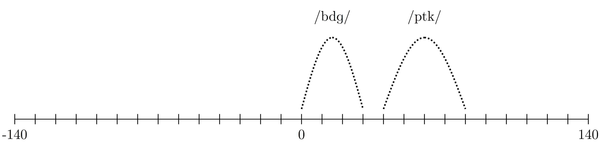

```{r setup, include=FALSE}
options(htmltools.dir.version = FALSE)
```

```{r xaringan-extra-all-the-things, echo=FALSE}
xaringanExtra::use_xaringan_extra(
  c("tile_view", "panelset", "editable" 
    #"scribble", "search", "webcam"
    )
)
```

```{r, 'helpers', echo=FALSE, message=F, warning=F}
source(here::here("slides", "assets", "scripts", "helpers.R"))
```

```{r, load_refs, echo=FALSE, cache=FALSE, warning=F, message=F}
bib <- ReadBib(here("slides", "assets", "bib", "ds4ling_refs.bib"), check = FALSE)
ui <- "- "
```

```{r 'global_setup', echo=FALSE}
opts_chunk$set(fig.retina=2, cache=FALSE)
```

class: title-slide-section-grey, middle

# Review

---
background-image: url(./assets/img/01_distributions.png)
background-size: contain

--

background-image: url(./assets/img/02_clt.png)
background-size: contain

--

background-image: url(./assets/img/03a_nhst.png)
background-size: contain

--

background-image: url(./assets/img/03b_hypothesis_testing.png)
background-size: contain

--

background-image: url(./assets/img/03c_ttest.png)
background-size: contain

--

background-image: url(./assets/img/05_correlation.png)
background-size: 400px

--

background-image: url(./assets/img/06a_bvar_reg.png)
background-size: contain

--

background-image: url(./assets/img/06b_bvar_reg.png)
background-size: contain

--

background-image: url(./assets/img/07_general_lm01.png)
background-size: contain

---
background-image: url(./assets/img/01_distributions.png), url(./assets/img/03a_nhst.png), url(./assets/img/05_correlation.png), url(./assets/img/06b_bvar_reg.png), url(./assets/img/07_general_lm01.png)
background-size: 400px, 400px, 400px, 400px, 400px
background-position: 5% 10%, 50% 50%, 95% 10%, 0% 95%, 100% 95%

---

# Review

.pull-left[

### What we know, where we've been

- Distributions
  - Normal distribution
  - CLT
- Hypothesis testing
  - z-tests
  - t-tests
- Bivariate correlation
- The linear model
  - Bivariate regression
  - Multiple regression and correlation
- The general linear model
  - Continuous predictors
  - Categorical predictors

]

--

.pull-right[

### What they have in common

- Criterion
  - Continuous
  - Linear relationship with predictors
  - $-\infty$ : $\infty$
  - Errors are normally distributed

]

---

# (P)review

### Where we're headed

- Sometimes we measure phenomena that are not continuous variables ranging from 
  $-\infty$ : $\infty$

<p></p>

- For example, we often analyze binary outcomes
  - Decisions
  - The presence/absence of a linguistic feature
  - Categorical perception 

<p></p>

- Sometimes we count things
  - Number of languages in a given area
  - Number of code switches during a linguistic interview

<p></p>

- We can extend our model in order to account for these different types of 
*dependent* variables

---
class: title-slide-section-grey, middle

# The generalized linear model

---

# The generalized linear model

### History

- Formulated by Nelder and Wedderburn (1972)
- The purpose was to unify (again) the different models being used at the time

### How

Recall that linear models contain a *systematic component* that specifies 
predictors (*X*<sub>1</sub>, *X*<sub>2</sub> ... *X*<sub>*k*</sub>), which, 
in turn, create our linear predictor (β<sub>0</sub> + β<sub>1</sub>*x*<sub>1</sub> ... β<sub>k</sub>*x*<sub>k</sub>). At a minimum, a GLM contains the following: 

.pull-left[

1) .blue[A data *distribution*]. This refers to the probability distribution of 
the response variable.

2) .blue[A *linking function*] that transforms the criterion used to model the 
data. It *links* the data distribution of the response variable to the 
systematic component of the model.

]

--

.pull-right[

3) .blue[An *estimator*], or method for obtaining parameter estimates

You (the researcher) are responsible for selecting (1) and (2). (3) is always 
the same.

]

---
background-image: url(./assets/img/glm_distributions.png)
background-size: 600px
background-position: 95% 50%

# The generalized linear model

### Distributions

#### Meet the (exponential) family

The exponential family is a series of probability  
distributions, each with its own properties. 

There are +/- 12, but we will focus on 3:

- Gaussian 

- Binomial 

- Poisson 

---

# The generalized linear model

### Linking functions

The linking function transforms the response variable in the manner most 
appropriate given the data distribution you have selected. 

- Identity: for gaussian response variable (normal distribution)

- Logit: for binary response variable (binomial distribution)

- Log: for count response variable (poisson distribution)

</br>

--

(more detail later)

---

# The generalized linear model

### The estimator: Maximum Likelihood Estimation (MLE)

<ru-blockquote>
Maximum likelihood estimation is the method that determines the values of the
parameters of the model. The parameter estimates are obtained in a way that 
maximizes the likelihood that the process described by the model produced 
the data that were actually observed.<sup>1</sup>
</ru-blockquote>

```{r, 'mle_ex', echo=FALSE, fig.width = 10, fig.height=4, fig.align='center'}
rnorm(100) %>% 
  tibble(x = ., y = rep(-0.07, 100)) %>% 
  ggplot(., aes(x = x, y = y)) + 
    ylim(-0.1, 1) + 
    xlim(-4, 4) + 
    stat_function(fun = dnorm, args = list(mean = 0, sd = 0.5), 
                  color = 'red', size = 1.5) + 
    stat_function(fun = dnorm, args = list(mean = -1, sd = 1), 
                  color = 'blue', size = 1.5) + 
    stat_function(fun = dnorm, args = list(mean = 1, sd = 1), 
                  color = 'green', size = 1.5) + 
    geom_point(pch = 21, color = 'white', fill = 'blue', 
               size = 5, stroke = 2, alpha = 0.9) + 
    ds4ling_bw_theme()
```

.footnote[<sup>1</sup> [Brooks-Bartlett](https://towardsdatascience.com/probability-concepts-explained-maximum-likelihood-estimation-c7b4342fdbb1) (2018)]

---
background-image: url(./assets/img/06a_bvar_reg.png)
background-size: 600px
background-position: 98%
class: middle

.pull-left[

## Recall that classical linear regression uses .RUred[*ordinary least squares estimation*] to determine the line that minimizes the residual sum of squares.

]

--

.footnote[You don't need to know the details behind MLE,  
but it never hurts to understand what is going on  
under the hood. [Brooks-Bartlett](https://towardsdatascience.com/probability-concepts-explained-maximum-likelihood-estimation-c7b4342fdbb1) (2018)  
is a good place to start if you are interested.]

---

# The generalized linear model

.pull-left[

### Something old

- It turns out we've spent the previous 11 weeks working with the gaussian 
distribution
- Gaussian is another way of saying normal
- This means we can think of standard linear regression in the general linear model as a special case of the generalized linear model
  - The errors are normally (gaussian) distributed
  - The criterion is associated with the linear predictors via an identity 
  linking function 
  - Instead of least squares estimation we use maximum likelihood estimation

]

--

.pull-right[

### Something new

- We can use different combinations of distributions and linking functions to 
model different outcome variables
- There are many options. Learning new modeling tools will open your mind to 
new experimental possibilities (if you only have a hammer, everything is a nail)
- We will focus on two types of regression that can be fit in the Generalized 
Linear Model framework: 
  1. Logistic regression (outcome variable is binary)
  2. Poisson regression (outcome variable represents counts)

]

---

# The generalized linear model

### Assumptions

- Data are independently distributed (independence of scores)

- Dependent variable follows a distribution from the exponential family

- Linear relationship between transformed response variable and predictors 
(linear relationship is result of linking function)

- Errors are independent (NOTE: they do not have to be normally distributed)

---

# The generalized linear model

### Doing it in R

#### The `glm()` function

- Thus far we have used the `lm()` function to fit models

- The `glm()` function works in the same way

--

```{r, cache=FALSE, eval=FALSE}
my_glm <- glm(criterion ~ pred1 + pred2 + pred1:pred2, # model formula
              data = my_df,                            # select dataframe
              family = gaussian(link = "identity"))    #<<
```

--

- Steps
  1. Specify the .blue[model formula]: `criterion ~ pred1 + pred2 + pred1:pred2`
  2. Select the .red[dataframe]: `data = my_df`
  3. Select a .green[distribution family] and .green[linking function]: 
  `family = gaussian(link = "identity")`

---

# The generalized linear model

.pull-left[

```{r, eval=FALSE, cache=FALSE}
# Standard lm()
lm(mpg ~ drat, data = mtcars)
```

```{r, 'lm_ex', echo=FALSE}
lm(mpg ~ drat, data = mtcars) %>% 
  tidy(.) %>% 
  kable(., format = 'html', digits = 3) %>% 
  kable_styling(., font_size = 16)
```
]

.pull-right[

```{r, eval=FALSE, cache=FALSE}
glm(mpg ~ drat, data = mtcars, 
    family = gaussian(link = "identity"))
```

```{r, 'glm_ex', echo=FALSE}
glm(mpg ~ drat, data = mtcars, 
    family = gaussian(link = "identity")) %>% 
  tidy(.) %>% 
  kable(., format = 'html', digits = 3) %>% 
  kable_styling(., font_size = 16)
```

]

--

</br>

<div align="center">

</div>

.center[**The standard linear model is a special case of the GLM**]

---
background-color: black
class: middle

```{r, cache=F, echo=F, fig.height=5, fig.width=8, out.extra="style='float:right'"}
seq(-10, 10, length.out = 300) %>% 
  tibble(x = ., y = inv_logit_manual(.)) %>% 
  ggplot(., aes(x = x, y = y)) + 
    geom_point(pch = 21, color = 'white', alpha = 0.7, size = 7) + 
    labs(y = NULL, x = NULL) + 
    annotate("text", x = -5, y = 0.75, color = 'white', parse = T, 
             label = TeX("$\\frac{1}{1 + e^{-x}}$", output = "character"), 
      fontface = 2, size = 8) + 
    theme_dark() + 
    theme(panel.border = element_rect(fill = NA, color = "black"),  
          plot.background = element_rect(color = "black", fill = "black"), 
          panel.background = element_rect(fill = "black", color  =  NA))

```

# Logistic regression

---

# Logistic regression

### Model setup

- The criterion is binary (0/1)

- The distribution for binary data is the **binomial** distribution

- The linking function is the **logit**

### How it works

- The logit linking function transforms the criterion so that it can be modeled by the linear predictor

$$logit(p) = log(\frac{p}{1 - p})$$

- In other words, the linking function transforms the 0/1 outcomes to 
$-\infty$ : $\infty$

$$log(\frac{p_{i}}{1 - p_{i}}) = \alpha + \beta_{1}X_{1} + \beta_{2}X_{2} + ... + \beta_{k}X_{k}$$

---
layout: false
class: middle

```{r, tiktok1, echo=F}
t1_url <- "https://www.tiktok.com/@chelseaparlettpelleriti/video/6871246394531876102"
t1 <- tiktok_embed(t1_url)
t1
```

---

```{r, 'lin_log_comp', cache=FALSE, echo=FALSE, fig.width=14, fig.height=8}
mod_lin <-  lm(resp ~ vot, data = vot_logistic_data)
mod_log <- glm(resp ~ vot, data = vot_logistic_data, family = "binomial")

p_lin <- ggplot(vot_logistic_data, aes(x = vot, y = resp)) + 
  geom_jitter(pch = 21, alpha = 0.1, height = 0.05, width = 6, color = 'blue') + 
  geom_smooth(method = lm, fullrange = TRUE, size = 1, formula = "y ~ x") + 
  geom_abline(intercept = coef(mod_lin)[1], slope = coef(mod_lin)[2], size = 1) + 
  coord_cartesian(ylim = c(-0.2, 1.2), xlim = c(-80, 80)) +
  scale_y_continuous(breaks = c(0, 1), labels = c(0, 1)) + 
  labs(y = "", x = "") + 
  ds4ling_bw_theme()

p_log <- ggplot(vot_logistic_data, aes(x = vot, y = resp)) + 
  geom_jitter(pch = 21, alpha = 0.1, height = 0.05, width = 6, color = 'darkred') + 
  geom_smooth(method = glm, method.args = list(family = "binomial"), 
              fullrange = T, size = 1, formula = "y ~ x") +
  stat_summary(aes(y = fitted(mod_log)), fun = mean, geom = "line") + 
  coord_cartesian(ylim = c(-0.2, 1.2), xlim = c(-80, 80)) + 
  scale_y_continuous(breaks = c(0, 1), labels = c(0, 1), position = "right") + 
  labs(y = "", x = "") + 
  ds4ling_bw_theme()

p_lin + p_log
```

---

# Logistic regression

### What you need to know

- Logistic regression is the most appropriate way to model binary response 
variables (0/1)

- The model calculates the probability that y = 1, i.e., the probability of a 
"success", or presence of something

- Model output from logistic regression is similar to `lm()`

- Model interpretation "works" the same way, i.e., a 1-unit change in 
`predictor` is associated with a change of X in the criterion

- But... the parameter estimates represent changes in the log-odds of y = 1

- This is much less intuitive, much more difficult to understand without some 
math

---

# Logistic regression

### Example

- You are interested in understanding the perception of stop voicing in 
English bilabials 

- You conducted an experiment in which participants heard a range of 
bilabial stops that differed in voice-onset time

- The stimuli ranged from -60 ms to 60 ms in 10 ms increments 

- Participants were presented stimuli drawn at random from the continuum and 
identified the sounds as /b/'s or /p/'s

- A /p/ response is coded as a 1

--

.center[]

---

# Logistic regression

```{r, eval=FALSE, cache=FALSE}
mod_log <- glm(resp ~ vot, data = vot_logistic_data, family = binomial(link = "logit"))
```

```{r, 'vot_ex', echo=FALSE}
summary(mod_log)
```

---

# Logistic regression

### Example

- We can convert the log-odds to probabilities by calculating the inverse 
logit<sup>1</sup>

```{r, inv_logit, echo=TRUE, warning=FALSE}
inv_logit(mod_log) %>% kable(., format = 'html')
```

--

- This is still difficult to interpret... a plot might help. 

</br></br></br></br></br>

<sup>1</sup> Inverse logit = $\frac{1}{1 + exp(-x)}$

---
class: middle

```{r, vot_plot, echo=FALSE, fig.width=14, fig.height=8}
glm_vot_plot <- ggplot(vot_logistic_data, aes(x = vot, y = resp)) + 
  geom_hline(yintercept = 0.5, lty = 3, size = 0.7) + 
  geom_jitter(pch = 21, alpha = 0.2, height = 0.02, width = 6, color = 'darkred') + 
  stat_summary(fun.data = mean_cl_boot, geom = 'pointrange') + 
  stat_summary(fun = mean, geom = 'point', pch = 21, 
               size = 6, fill = 'white') + 
  geom_smooth(method = glm, method.args = list(family = "binomial"), 
              fullrange = T, size = 1, formula = "y ~ x") +
  coord_cartesian(ylim = c(-0.05, 1.05)) + 
  scale_y_continuous(breaks = c(0, 0.25, 0.5, 0.75, 1), 
                     labels = c(0, 0.25, 0.5, 0.75, 1)) + 
  scale_x_continuous(breaks = seq(-60, 60, 10), labels = seq(-60, 60, 10)) + 
  labs(y = "Probability of /p/", x = "VOT (ms)") + 
  ds4ling_bw_theme(base_size = 18, base_family = "Times")

glm_vot_plot
```

---
class: middle

.pull-left[
```{r, inv_logit_repeat, echo=TRUE, warning=FALSE}
inv_logit(mod_log) %>% kable(., format = 'html')
```

</br>

- Now the intercept is interpretable  
(note it is already centered)

- What does the parameter estimate  
for VOT mean?

- Can calculate how the probability  
differs from one specific point to  
another?

]

.pull-right[

```{r, 'repeat-glm-vot-plot', echo=FALSE, out.width="100%"}
glm_vot_plot
```

]

---
class: middle

.pull-left[

#### We can use the model coefficients

```{r, vot_coef, echo=FALSE}
tidy(mod_log) %>% 
  kable(., format = 'html', digits = 3) %>% 
  kable_styling(., font_size = 16)
```

- Calculate the inverse logit of the  
linear equation:  

$$\alpha + \beta_{VOT} * 10ms$$

```{r, mod_probs, cache=FALSE}
inv_logit_manual(-0.846 + 0.057 * 10)
```

- What about the change in probability of selecting /p/ when shifting from 10 ms 
to 20 ms?

```{r, mod_probs2, cache=FALSE}
inv_logit_manual(-0.846 + 0.057 * 20) - 
inv_logit_manual(-0.846 + 0.057 * 10)
```

The shift from 10ms to 20 ms VOT corresponds  
with a positive difference of 14% in 
the probability of selecting /p/

]

.pull-right[

```{r, 'repeat-glm-vot-plot2', echo=FALSE, out.width="100%"}
glm_vot_plot
```

]

---

# Logistic regression

### Summary

- Logistic regression is a powerful tool for modeling binary data

- The `glm()` function works similarly to the `lm()` function 

- We test for main effects and interactions the same way too, i.e., using 
nested model comparisons with the `anova()` function

- The exponential family and corresponding linking function are  
`family = binomial(link = "logit")`

- Interpretation of logistic regression works the same way as classic linear 
regression 

- Parameter estimates are evaluated in log odds (and require some work in order 
to accurately interpret them)

---
layout: false
class: middle

```{r, tiktok2, echo=F}
t2_url <- "https://www.tiktok.com/@chelseaparlettpelleriti/video/6828303282482449669"
t2 <- tiktok_embed(t2_url)
t2
```

---

# Practice

- [Logistic regression practice](./assets/logistic_regression_walkthrough/glm_logistic.zip)

---


background-color: black
class: middle

```{r, cache=F, echo=F, fig.height=5, fig.width=8, out.extra="style='float:right'"}
n     <- 500
beta0 <- 5
beta1 <- 0.2

x  <- seq(0, 10, length.out = n)
mu <- exp(beta0 + beta1 * x + rnorm(n, 0, 0.2))
y  <- rpois(n = n, lambda = mu)

poisson_plot <- tibble(x, y) %>%
  ggplot(., aes(x = x, y = y)) + 
    geom_point(pch = 21, color = 'white', alpha = 0.5, size = 3) + 
    labs(y = "", x = "") +
    annotate("text", x = 2.5, y = 1000, color = 'white', parse = T, 
             label = TeX("$Y \\sim P(\\mu)$", output = "character"), fontface = 2, size = 8) + 
    geom_smooth(method = "glm", method.args = list(family = "poisson"), 
                size = 2, color = "darkred", se = T, formula = "y ~ x") + 
    theme_dark() + 
    theme(panel.border = element_rect(fill = NA, color = "black"),  
          plot.background = element_rect(color = "black", fill = "black"), 
          panel.background = element_rect(fill = "black", color  =  NULL))

poisson_plot
```

# Poisson regression

---

# Poisson regression

### Model setup

- The criterion is a non-negative number (0, 1, 2...)

- The distribution for count data is typically the **poisson** distribution

- The linking function is **log** 

--

### How it works

- The log linking function transforms the criterion so that it can be modeled by 
the linear predictor

$$g(u) = exp(u)$$

- Conversely, this can be understood as exponentiating the linear predictor to 
make the values non-negative

$$y_{i} = exp(\alpha + \beta_{1}X_{1} + \beta_{2}X_{2} + ... + \beta_{k}X_{k})$$

---
class: middle

```{r, 'lin_poisson_comp', cache=FALSE, echo=FALSE, fig.width=14, fig.height=8}
mod_lin_count <-  lm(units ~ temp, data = ice_cream_poisson_data)
mod_poisson   <- glm(units ~ temp, data = ice_cream_poisson_data, family = poisson(link = "log"))

p_lin_count <- ggplot(ice_cream_poisson_data, aes(x = temp, y = units)) + 
  geom_point(pch = 21) + 
  geom_smooth(method = lm, fullrange = TRUE, size = 2, formula = "y ~ x") + 
  scale_y_continuous(breaks = NULL, labels = NULL) + 
  scale_x_continuous(breaks = NULL, labels = NULL) + 
  labs(y = "", x = "") + 
  ds4ling_bw_theme()

p_poisson <- ggplot(ice_cream_poisson_data, aes(x = temp, y = units)) + 
  geom_point(pch = 21) + 
  geom_smooth(method = glm, method.args = list(family = "poisson"), 
              fullrange = T, size = 2, formula = "y ~ x") +
  scale_y_continuous(breaks = NULL, labels = NULL, position = "right") + 
  scale_x_continuous(breaks = NULL, labels = NULL) + 
  labs(y = "", x = "") + 
  ds4ling_bw_theme()

p_lin_count + p_poisson
```

---

# Poisson regression

### What you need to know

- Poisson regression is the most appropriate way to model count data 
(0, 1, 2...)

- Model output from poisson regression is similar to `lm()`

- Model interpretation "works" the same way, i.e., a 1-unit change in 
`predictor` is associated with a change of X in the criterion

- But... the parameter estimates represent changes in the criterion on a 
logarithmic scale

- The parameter estimates that can be interpreted as multiplicative effects

- This is not too difficult to understand

---

# Poisson regression

### Example

.pull-left[

```{r, echo=TRUE, eval=FALSE, cache=FALSE}
glm(units ~ temp, 
    data = ice_cream_poisson_data, 
    family = poisson(link = "log")) #<<
```

```{r, 'mod_poisson', echo=FALSE, cache=FALSE}
mod_poisson %>% 
  tidy(.) %>% 
  kable(., format = 'html', digits = 3) %>% 
  kable_styling(., font_size = 14)
```

]

--

.pull-right[

```{r, 'icecream_plot1', cache=FALSE, echo=FALSE, fig.height=5}
ggplot(ice_cream_poisson_data, aes(x = temp, y = units)) + 
  geom_point(pch = 21, fill = 'grey80') + 
  geom_smooth(method = glm, method.args = list(family = "poisson"), 
    formula = "y ~ x") + 
  scale_color_brewer(palette = "Set1", name = "") + 
  labs(x = "Temperature", y = "Units ice cream sold") + 
  ds4ling_bw_theme(base_size = 20, base_family = "Times")
```

]

--

.footnote[
- A 1 unit change in temperature is associated with a  
change of `r round(coef(mod_poisson)[2], 2)` log units in ice cream sold. 

- We can exponentiate `r round(coef(mod_poisson)[2], 2)` to make it more  
interpretable.  `exp(coef(mod_poisson)[2])` = 
`r round(coef(mod_poisson)[2], 2)`

- A 1 unit change in temperature gives a 4% positive  
increase in ice cream sold.
]

---

# Poisson regression

### Example

.pull-left[

```{r, echo=TRUE, eval=FALSE, cache=FALSE}
glm(units ~ temp + city, #<<
    data = ice_cream_poisson_data, 
    family = poisson(link = "log"))
```

```{r, 'mod_poisson_city', echo=FALSE}
glm(units ~ temp + city, 
    data = ice_cream_poisson_data, 
    family = poisson(link = "log")) %>% 
  tidy(.) %>% 
  kable(., format = 'html', digits = 3) %>% 
  kable_styling(., font_size = 14)
```

]

--

.pull-right[

```{r, 'icecream_plot2', cache=FALSE, echo=FALSE, fig.height=5}
ggplot(ice_cream_poisson_data, aes(x = temp, y = units, color = city)) + 
  geom_point(pch = 21, fill = 'grey80') + 
  geom_smooth(method = glm, method.args = list(family = "poisson"), 
    formula = "y ~ x") + 
  scale_color_brewer(palette = "Set1", name = "") + 
  labs(x = "Temperature", y = "Units ice cream sold") + 
  ds4ling_bw_theme(base_size = 20, base_family = "Times")
```

]

--

.footnote[
- A 1 unit change in temperature is associated with a  
positive difference of approx. 4% in ice cream sold  
in NYC. 

- When temp = 0, ice cream sold in Tucson is approx.  
`r round(exp(-0.542), 2) * 100`% less

]

---

# Poisson regression

### Example

.pull-left[

```{r, echo=TRUE, eval=FALSE, cache=FALSE}
ice_cream_poisson_data %>% 
  mutate(., temp_c = temp - mean(temp)) %>% 
  glm(units ~ temp_c + city, #<<
      data = ., 
      family = poisson(link = "log"))
```

```{r, 'mod_poisson_city_centered', echo=FALSE}
ice_cream_poisson_data %>% 
  mutate(., temp_c = temp - mean(temp)) %>% 
  glm(units ~ temp_c + city, 
      data = ., 
      family = poisson(link = "log")) %>% 
  tidy(.) %>% 
  kable(., format = 'html', digits = 3) %>% 
  kable_styling(., font_size = 14)
```

]

--

.pull-right[

```{r, 'icecream_plot3', cache=FALSE, echo=FALSE, fig.height=5}
ice_cream_poisson_data %>% 
ggplot(., aes(x = (temp - mean(temp)), y = units, color = city)) + 
  geom_point(pch = 21, fill = 'grey80') + 
  geom_smooth(method = glm, method.args = list(family = "poisson"), 
    formula = "y ~ x") + 
  geom_vline(xintercept = 0, lty = 3) + 
  scale_color_brewer(palette = "Set1", name = "") + 
  labs(x = "Temperature", y = "Units ice cream sold") + 
  ds4ling_bw_theme(base_size = 20, base_family = "Times")
```

]

--

.footnote[
- A 1 unit change in temperature is associated with a  
positive difference of approx. 4% in ice cream sold  
in NYC. 

- At the average temperature (`r mean(ice_cream_poisson_data$temp)`), ice cream  
sold in Tucson is (still) approx. `r round(exp(-0.542), 2) * 100`% less

]

---

# Poisson regression

### Summary

- Poisson regression is a powerful tool for modeling count data

- The `glm()` function works similarly to the `lm()` function 

- We test for main effects and interactions the same way too, i.e., using 
nested model comparisons with the `anova()` function

- The exponential family and corresponding linking function are  
`family = poisson(link = "log")`

- Interpretation of poisson regression works the same way as classic linear 
regression 

- Parameter estimates are evaluated on a log (multiplicative) scale and are 
not difficult to interpret

---

<iframe src="https://jvcasillas.shinyapps.io/shiny_glm/" style="border:none;" height="800" width="100%"></iframe>

---

# Practice

- [Poisson regression practice](./assets/poisson_regression_walkthrough/glm_poisson.zip)


---
exclude: true

`r AutoCite(bib, c("wickham2016r", "qass93_ch2", "qass93_ch3", "qass93_ch4"))`

---
layout: false
class: title-slide-final, left

# References

```{r, 'refs', results='asis', echo=FALSE, eval=TRUE, cache=FALSE}
PrintBibliography(bib)
```

Nelder, J., Wedderburn, R. (1972). Generalized Linear Models. *Journal of the Royal Statistical Society*. 135 (3). 370–384.
